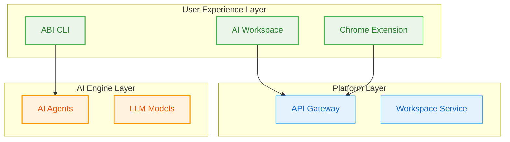
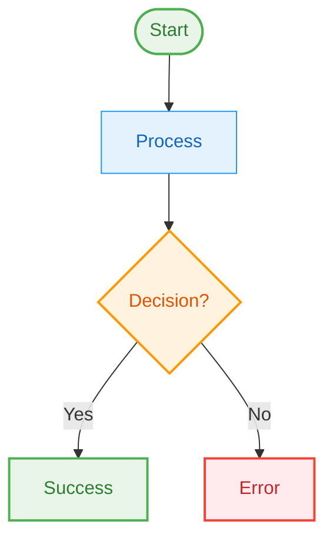
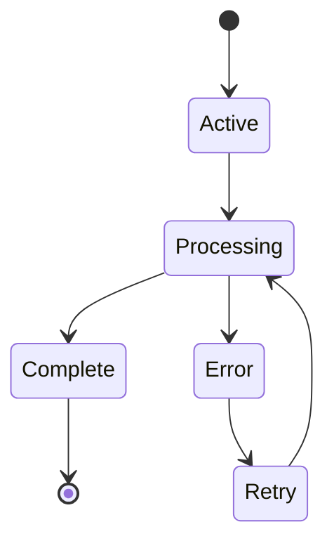
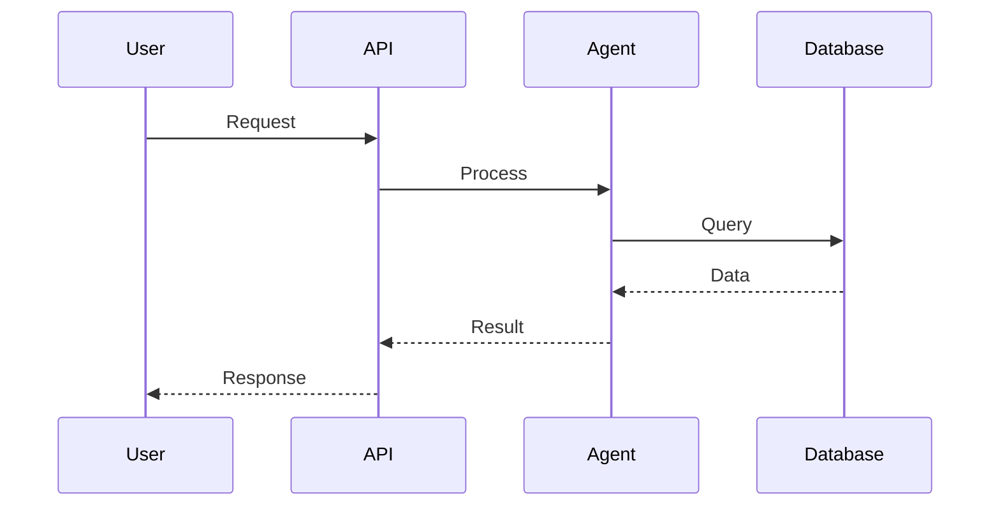
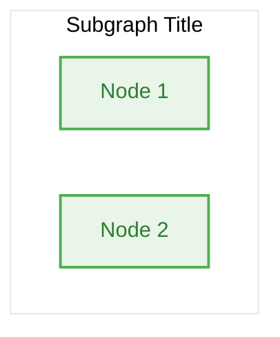

# Mermaid Styling Standards

This document defines the consistent styling approach for all Mermaid diagrams in Naas documentation.

## Enhanced Code Highlighting Examples

Our documentation now supports enhanced syntax highlighting for ontology-related languages:

### RDF/Turtle Example

```turtle title="BFO Core Classes"
@prefix bfo: <http://purl.obolibrary.org/obo/> .
@prefix rdfs: <http://www.w3.org/2000/01/rdf-schema#> .

# highlight-start
bfo:BFO_0000001 a owl:Class ;
    rdfs:label "entity" ;
    rdfs:comment "An entity is anything that exists or has existed or will exist." .
# highlight-end

bfo:BFO_0000002 a owl:Class ;
    rdfs:subClassOf bfo:BFO_0000001 ;
    rdfs:label "continuant" ;
    # highlight-next-line
    rdfs:comment "A continuant is an entity that persists, endures, or continues to exist through time." .
```

### SPARQL Query Example

```sparql title="Find All AI Agents"
PREFIX abi: <https://ontology.naas.ai/abi/>
PREFIX bfo: <http://purl.obolibrary.org/obo/>

SELECT ?agent ?label ?capability WHERE {
    # highlight-start
    ?agent a abi:AIAgent ;
           rdfs:label ?label ;
           abi:hasCapability ?capability .
    # highlight-end
    
    FILTER(LANG(?label) = "en")
} ORDER BY ?label
```

### JSON-LD Example

```json title="ABI Agent Context"
{
  "@context": {
    "abi": "https://ontology.naas.ai/abi/",
    "bfo": "http://purl.obolibrary.org/obo/",
    "rdfs": "http://www.w3.org/2000/01/rdf-schema#"
  },
  "@type": "abi:AIAgent",
  "@id": "abi:ChatAgent001",
  "rdfs:label": "Customer Support Agent",
  "abi:hasCapability": [
    "abi:NaturalLanguageProcessing",
    "abi:IntentRecognition"
  ]
}
```

### Python Ontology Processing

```python title="ontology_processor.py"
from rdflib import Graph, Namespace

# Load ontology
g = Graph()
g.parse("abi-ontology.ttl", format="turtle")

# Define namespaces
ABI = Namespace("https://ontology.naas.ai/abi/")
BFO = Namespace("http://purl.obolibrary.org/obo/")

# Query for AI agents
query = """
SELECT ?agent ?label WHERE {
    ?agent a abi:AIAgent ;
           rdfs:label ?label .
}
"""

for row in g.query(query):
    print(f"Agent: {row.agent}, Label: {row.label}")
```

## Color Scheme

### Primary Colors
- **User Experience Layer**: `#e8f5e8` (light green) - Components users directly interact with
- **Platform Layer**: `#e3f2fd` (light blue) - Core platform services and APIs  
- **AI Engine Layer**: `#fff3e0` (light orange) - AI/ML components and agents
- **Data Layer**: `#f3e5f5` (light purple) - Data storage and knowledge graphs
- **Infrastructure Layer**: `#fce4ec` (light pink) - Infrastructure and deployment

### Accent Colors
- **Success/Active**: `#4caf50` (green)
- **Primary/Platform**: `#2196f3` (blue)
- **Warning/AI**: `#ff9800` (orange)
- **Data/Ontology**: `#9c27b0` (purple)
- **Error/Critical**: `#f44336` (red)

## Standard Class Definitions

```mermaid
classDef userExp fill:#e8f5e8,stroke:#4caf50,stroke-width:2px,color:#2e7d32
classDef platform fill:#e3f2fd,stroke:#2196f3,stroke-width:1px,color:#1565c0
classDef aiEngine fill:#fff3e0,stroke:#ff9800,stroke-width:2px,color:#e65100
classDef dataLayer fill:#f3e5f5,stroke:#9c27b0,stroke-width:1px,color:#4a148c
classDef infrastructure fill:#fce4ec,stroke:#e91e63,stroke-width:1px,color:#880e4f
```

## Usage Guidelines

### Component Classification
- **userExp**: Web interfaces, mobile apps, browser extensions, CLI tools
- **platform**: APIs, gateways, core services, orchestration layers
- **aiEngine**: AI agents, models, reasoning systems, LLM integrations
- **dataLayer**: Databases, knowledge graphs, ontologies, vector stores
- **infrastructure**: Kubernetes, containers, cloud services, monitoring

### Diagram Types

#### Architecture Diagrams
Use layered approach with subgraphs for clear separation:



#### Process Flow Diagrams
Use single color scheme with emphasis on flow:



#### State Diagrams
Use consistent coloring for state types:



#### Sequence Diagrams
Sequence diagrams don't have subgraphs, so no theme configuration needed:



**Note**: Only apply the theme configuration to diagrams with subgraphs (graph TD, graph LR, stateDiagram-v2). Sequence diagrams use default styling.

## Implementation

### Template for New Diagrams

```markdown


### Subgraph Styling

**Critical for consistency**: Use the exact same Mermaid theme configuration as the platform overview:

```
%%{init: {'theme':'base', 'themeVariables': {'primaryColor': '#f8fafc', 'primaryTextColor': '#1e293b', 'primaryBorderColor': '#e2e8f0', 'lineColor': '#64748b'}}}%%
```

This theme configuration:
- **Ensures white subgraph backgrounds** in both light and dark modes
- **Matches the platform overview** exactly
- **Uses standard subgraph syntax**: `subgraph "Title"` (no ID needed)
- **Controls colors globally** through theme variables

Always add this as the **first line** of every mermaid diagram for consistency.

### Validation Checklist
- [ ] Color scheme matches Naas brand guidelines
- [ ] All nodes have appropriate class assignments
- [ ] Stroke widths emphasize importance (2px for user-facing, 1px for internal)
- [ ] Text color provides sufficient contrast
- [ ] Diagram is readable at different zoom levels
- [ ] Consistent with other diagrams in the same section
