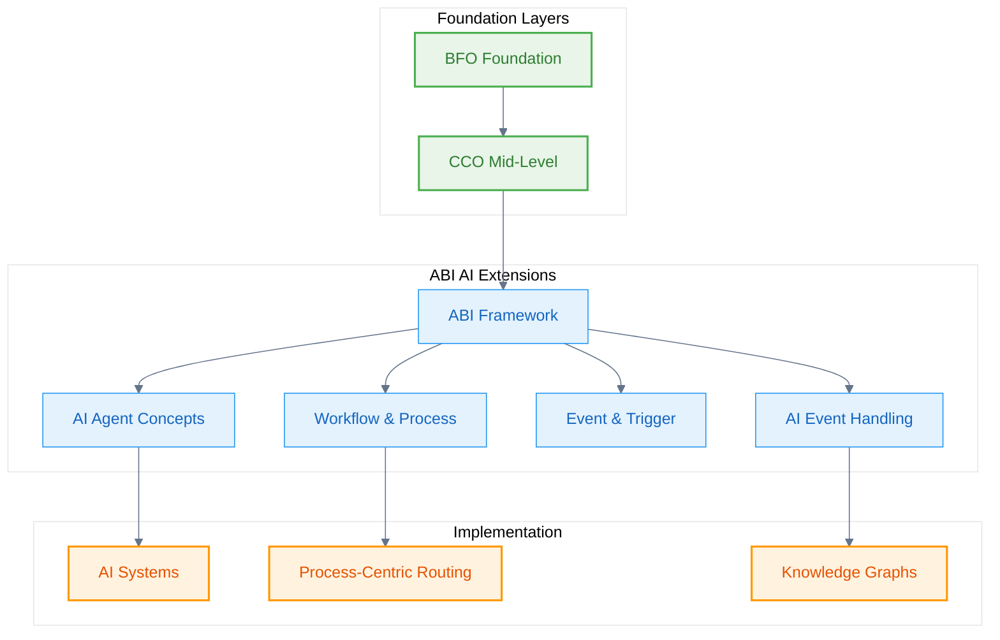

# Agentic Brain Infrastructure (ABI)

**ABI** provides AI-specific ontological concepts that extend BFO and CCO for artificial intelligence systems, agents, and workflows.

## ABI Architecture

ABI extends the ontological hierarchy with AI-focused concepts:

## Domain-Level Ontologies

- **[AIAgent](/abi/AIAgent)** - AI systems, agents, model instances, and capabilities
- **[Capability](/abi/Capability)** - Cognitive capabilities following Smith & Beverley framework
- **[Message](/abi/Message)** - Communication processes and messaging roles (BFO-based)
- **[Offering](/abi/Offering)** - Products, services, solutions, and market segments
- **[Organization](/abi/Organization)** - Commercial entities, strategic alliances, and partnerships
- **[Person](/abi/Person)** - Individual persons, skills, and professional relationships

## Process-Level Ontologies

- **[Templatable SPARQL](/abi/SparqlQueries)** - Query templates and intent mapping system

## Key Features

### Process-Centric Routing
ABI enables intelligent agent selection based on cognitive processes rather than specific AI models.

### Ontological Grounding
All AI concepts are systematically grounded in BFO categories for consistency and interoperability.

### Modular Architecture
Each AI module extends the core framework with specialized capabilities.

## See Also

- [Applications](/applications) - Specific application integrations extending ABI concepts
- [Ontology Essentials - Domain-Level](/ontology-essentials/domain-level) - Detailed ABI implementation
- [Process-Centric Routing](/ontology-essentials/process-routing) - AI routing based on cognitive processes
- [CCO Extensions](/cco) - Mid-level concepts that ABI extends
