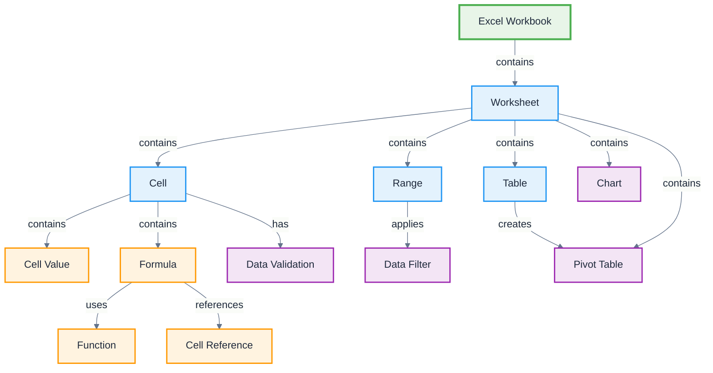

# Excel

**Definition:** Application ontology for Microsoft Excel spreadsheet application, modeling workbooks, worksheets, cells, formulas, and data analysis elements.

**Parent:** [Artifact](/cco/Artifact)

**See also:** [Word](/applications/Word), [PowerPoint](/applications/PowerPoint)

:::note
This application ontology is not fully vetted and is subject to changes as we refine the modeling approach for third-party integrations.
:::

## Modeling Notes

- Excel workbooks contain multiple worksheets with grid-based cell structure
- Cells can contain values, formulas, or references to other cells
- Supports complex data analysis, calculations, charts, and pivot tables
- Formula system enables dynamic calculations and data relationships
- Data validation and conditional formatting provide data quality controls

## Core Classes

### **Workbook Structure**
- **Excel Workbook** - Complete spreadsheet file (.xlsx, .xls)
- **Worksheet** - Individual spreadsheet tab with cell grid
- **Cell** - Individual data container at row/column intersection
- **Range** - Rectangular selection of multiple cells
- **Named Range** - User-defined cell range with custom name
- **Table** - Structured data range with headers and formatting

### **Data Elements**
- **Cell Value** - Raw data content (number, text, date, boolean)
- **Formula** - Calculation expression using functions and references
- **Function** - Built-in calculation operations (SUM, VLOOKUP, etc.)
- **Cell Reference** - Pointer to another cell or range
- **Data Validation** - Rules constraining cell input values
- **Conditional Format** - Visual formatting based on cell values

### **Analysis Elements**
- **Chart** - Visual representation of data
- **Pivot Table** - Interactive data summarization tool
- **Pivot Chart** - Chart based on pivot table data
- **Data Filter** - Tool for showing/hiding rows based on criteria
- **Sort** - Data ordering operations
- **Subtotal** - Automatic calculation groupings

## Schema Structure



## Implementation Examples

### **Workbook Structure**
```turtle
@prefix excel: <http://ontology.naas.ai/applications/excel/> .
@prefix abi: <http://ontology.naas.ai/abi/> .
@prefix cco: <http://purl.obolibrary.org/obo/> .

# Complete workbook
excel:SalesAnalysisWorkbook a excel:ExcelWorkbook ;
    rdfs:label "Q4 Sales Analysis 2024"@en ;
    excel:hasWorksheet excel:RawDataSheet,
                       excel:AnalysisSheet,
                       excel:ChartsSheet,
                       excel:DashboardSheet ;
    excel:createdBy abi:AnalystAgent ;
    excel:lastModified "2024-01-15T11:20:00Z"^^xsd:dateTime ;
    excel:fileSize "2.4MB" .

# Individual worksheet
excel:AnalysisSheet a excel:Worksheet ;
    rdfs:label "Sales Analysis"@en ;
    excel:sheetIndex 2 ;
    excel:hasRowCount 1000 ;
    excel:hasColumnCount 15 ;
    excel:containsTable excel:SalesTable ;
    excel:containsChart excel:RevenueChart .
```

### **Cell and Formula Structure**
```turtle
# Cell with formula
excel:TotalRevenueCell a excel:Cell ;
    rdfs:label "Total Revenue Cell"@en ;
    excel:cellAddress "B15" ;
    excel:containsFormula excel:SumFormula ;
    excel:hasFormat excel:CurrencyFormat ;
    excel:calculatedValue "1250000.00"^^xsd:decimal .

# Formula with functions
excel:SumFormula a excel:Formula ;
    rdfs:label "Revenue Sum Formula"@en ;
    excel:formulaText "=SUM(B2:B14)" ;
    excel:usesFunction excel:SumFunction ;
    excel:referencesRange excel:RevenueRange ;
    excel:isVolatile false .

# Named range
excel:RevenueRange a excel:NamedRange ;
    rdfs:label "Revenue Range"@en ;
    excel:rangeName "RevenueData" ;
    excel:rangeAddress "B2:B14" ;
    excel:containsDataType "Currency" .
```

### **Data Analysis Elements**
```turtle
# Chart object
excel:RevenueChart a excel:Chart ;
    rdfs:label "Monthly Revenue Chart"@en ;
    excel:chartType "Column" ;
    excel:dataSource excel:RevenueRange ;
    excel:hasTitle "Monthly Revenue Trend" ;
    excel:hasXAxis excel:MonthAxis ;
    excel:hasYAxis excel:RevenueAxis ;
    excel:chartPosition "D2:J15" .

# Pivot table
excel:SalesPivotTable a excel:PivotTable ;
    rdfs:label "Sales by Region Pivot"@en ;
    excel:sourceData excel:SalesTable ;
    excel:hasRowField excel:RegionField ;
    excel:hasColumnField excel:MonthField ;
    excel:hasValueField excel:RevenueField ;
    excel:pivotPosition "A20:E35" .

# Data validation
excel:RegionValidation a excel:DataValidation ;
    rdfs:label "Region Code Validation"@en ;
    excel:validationType "List" ;
    excel:validationSource "North,South,East,West" ;
    excel:errorMessage "Please select a valid region" ;
    excel:appliedToRange "C2:C1000" .
```

## AI Integration Patterns

### **Data Analysis**
- **Pattern Recognition** - AI identifies trends and anomalies in data
- **Predictive Modeling** - Forecast future values based on historical data
- **Statistical Analysis** - Automated statistical calculations and insights
- **Data Cleaning** - AI-powered data quality improvement

### **Formula Generation**
- **Smart Formulas** - AI suggests appropriate formulas for calculations
- **Complex Calculations** - Generate multi-step calculation sequences
- **Error Detection** - Identify and suggest fixes for formula errors
- **Optimization** - Improve formula performance and accuracy

### **Visualization**
- **Chart Recommendations** - AI suggests optimal chart types for data
- **Dashboard Creation** - Automated dashboard layout and design
- **Conditional Formatting** - Intelligent visual highlighting rules
- **Data Storytelling** - Generate insights and narratives from data

## Data Processing Workflows

### **ETL Operations**
```turtle
excel:DataETLWorkflow a abi:Workflow ;
    rdfs:label "Excel Data ETL Process"@en ;
    abi:hasStep excel:DataExtraction,
                excel:DataTransformation,
                excel:DataLoading ;
    abi:processesData excel:RawDataSheet ;
    abi:outputsData excel:CleanDataSheet .
```

### **Reporting Automation**
```turtle
excel:ReportGenerationWorkflow a abi:Workflow ;
    rdfs:label "Automated Report Generation"@en ;
    abi:triggeredBy abi:ScheduledEvent ;
    abi:refreshesData excel:SalesTable ;
    abi:updatesChart excel:RevenueChart ;
    abi:generatesPDF excel:SalesReport .
```

## Integration Points

### **Data Sources**
- **Database Connections** - SQL Server, Oracle, MySQL integration
- **Web Data** - REST APIs and web service connections
- **Cloud Services** - Azure, AWS, Google Cloud data sources
- **File Imports** - CSV, XML, JSON data import capabilities

### **External Applications**
- **Power BI Integration** - Business intelligence dashboards
- **SharePoint Lists** - Collaborative data management
- **Outlook Integration** - Email report distribution
- **Teams Integration** - Collaborative spreadsheet editing

## Advanced Features

### **Macros and VBA**
```turtle
excel:SalesReportMacro a excel:VBAMacro ;
    rdfs:label "Sales Report Generation Macro"@en ;
    excel:macroCode "Sub GenerateSalesReport()..." ;
    excel:triggeredBy excel:ButtonClick ;
    excel:performsAction excel:FormatReport,
                        excel:CreateCharts,
                        excel:SaveAsPDF .
```

### **Data Models**
```turtle
excel:SalesDataModel a excel:DataModel ;
    rdfs:label "Sales Analysis Data Model"@en ;
    excel:containsTable excel:SalesTable,
                        excel:ProductTable,
                        excel:CustomerTable ;
    excel:hasRelationship excel:SalesProductRelation ;
    excel:enablesPowerPivot true .
```

## Security and Governance

### **Data Protection**
- **Worksheet Protection** - Lock cells and formulas from editing
- **Workbook Protection** - Control structural changes
- **Password Protection** - File-level access control
- **Information Rights Management** - Usage restrictions

### **Audit and Compliance**
- **Formula Auditing** - Track cell dependencies and precedents
- **Change Tracking** - Monitor data modifications
- **Version Control** - Maintain historical versions
- **Data Lineage** - Track data source and transformation history

## See Also

- [Word](/applications/Word) - Document processing application
- [PowerPoint](/applications/PowerPoint) - Presentation application
- [Data Source](/applications/DataSource) - Generic data integration patterns
- [Information Object](/cco/InformationObject) - CCO information modeling
