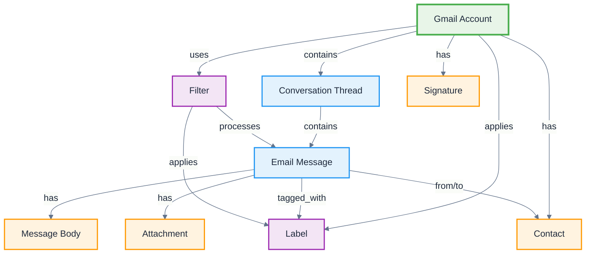

# Gmail

**Definition:** Application ontology for Gmail email platform, modeling messages, threads, labels, and email-specific communication patterns.

**Parent:** [Artifact](/cco/Artifact)

**See also:** [Google Calendar](/applications/GoogleCalendar), [Google Workspace](/applications/GoogleWorkspace)

:::note
This application ontology is not fully vetted and is subject to changes as we refine the modeling approach for third-party integrations.
:::

## Modeling Notes

- Gmail organizes emails in conversation threads rather than individual messages
- Labels provide flexible categorization beyond traditional folder structures
- Supports rich email content including attachments, inline images, and formatting
- Integration with Google services enables smart features and automation
- Conversation-based threading maintains context across email exchanges

## Core Classes

### **Message Structure**
- **Gmail Account** - User email account with settings and preferences
- **Email Message** - Individual email with headers, body, and metadata
- **Conversation Thread** - Related messages grouped by subject and participants
- **Email Address** - Sender/recipient identifier with display name
- **Message Body** - Email content in plain text or HTML format
- **Attachment** - Files attached to email messages

### **Organization Elements**
- **Label** - Flexible categorization tags (replaces traditional folders)
- **Filter** - Automated rules for message processing and labeling
- **Search Query** - Advanced search expressions for finding messages
- **Mailbox** - Container for messages (Inbox, Sent, Drafts, etc.)
- **Archive** - Long-term message storage outside active mailboxes

### **Communication Features**
- **Contact** - Person or entity with email address and metadata
- **Contact Group** - Collection of related contacts
- **Signature** - Automatic text appended to outgoing messages
- **Auto-Reply** - Automated response messages
- **Priority Inbox** - Intelligent message importance classification

## Schema Structure



## Implementation Examples

### **Email Message Structure**
```turtle
@prefix gmail: <http://ontology.naas.ai/applications/gmail/> .
@prefix abi: <http://ontology.naas.ai/abi/> .
@prefix cco: <http://purl.obolibrary.org/obo/> .

# Gmail account
gmail:UserAccount a gmail:GmailAccount ;
    rdfs:label "john.doe@company.com"@en ;
    gmail:emailAddress "john.doe@company.com" ;
    gmail:displayName "John Doe" ;
    gmail:hasLabel gmail:WorkLabel,
                   gmail:ProjectLabel,
                   gmail:ImportantLabel ;
    gmail:storageUsed "2.3GB" ;
    gmail:storageQuota "15GB" .

# Conversation thread
gmail:ProjectThread a gmail:ConversationThread ;
    rdfs:label "Q4 Project Planning Discussion"@en ;
    gmail:threadId "thread_12345" ;
    gmail:subject "Q4 Project Planning" ;
    gmail:messageCount 8 ;
    gmail:containsMessage gmail:InitialMessage,
                          gmail:ReplyMessage1,
                          gmail:ReplyMessage2 ;
    gmail:hasLabel gmail:ProjectLabel ;
    gmail:lastActivity "2024-01-15T14:30:00Z"^^xsd:dateTime .
```

### **Message Content**
```turtle
# Individual email message
gmail:InitialMessage a gmail:EmailMessage ;
    rdfs:label "Project Planning Kickoff"@en ;
    gmail:messageId "msg_67890" ;
    gmail:fromAddress gmail:SenderContact ;
    gmail:toAddress gmail:RecipientContact1,
                    gmail:RecipientContact2 ;
    gmail:subject "Q4 Project Planning - Let's Schedule" ;
    gmail:sentDate "2024-01-10T09:00:00Z"^^xsd:dateTime ;
    gmail:hasBody gmail:MessageBody ;
    gmail:hasAttachment gmail:ProjectDocument ;
    gmail:isRead true ;
    gmail:isStarred false .

# Message body content
gmail:MessageBody a gmail:MessageBody ;
    rdfs:label "Project planning email body"@en ;
    gmail:contentType "text/html" ;
    gmail:textContent "Hi team, let's schedule our Q4 planning meeting..." ;
    gmail:htmlContent "<p>Hi team,</p><p>Let's schedule our Q4 planning meeting...</p>" ;
    gmail:wordCount 156 .

# Email attachment
gmail:ProjectDocument a gmail:Attachment ;
    rdfs:label "Q4_Project_Plan.pdf"@en ;
    gmail:fileName "Q4_Project_Plan.pdf" ;
    gmail:fileSize "2.1MB" ;
    gmail:mimeType "application/pdf" ;
    gmail:attachmentId "att_54321" .
```

### **Organization and Automation**
```turtle
# Labels for organization
gmail:ProjectLabel a gmail:Label ;
    rdfs:label "Projects"@en ;
    gmail:labelName "Projects" ;
    gmail:labelColor "#4285f4" ;
    gmail:messageCount 47 ;
    gmail:isSystemLabel false .

# Email filter
gmail:ProjectFilter a gmail:Filter ;
    rdfs:label "Auto-label project emails"@en ;
    gmail:filterCriteria "from:project-team@company.com OR subject:project" ;
    gmail:applyLabel gmail:ProjectLabel ;
    gmail:markImportant true ;
    gmail:skipInbox false .

# Contact information
gmail:SenderContact a gmail:Contact ;
    rdfs:label "Jane Smith"@en ;
    gmail:emailAddress "jane.smith@company.com" ;
    gmail:displayName "Jane Smith" ;
    gmail:isFrequentContact true ;
    gmail:lastContactDate "2024-01-15T14:30:00Z"^^xsd:dateTime .
```

## AI Integration Patterns

### **Smart Compose & Reply**
- **Smart Compose** - AI-powered email writing suggestions
- **Smart Reply** - Quick response suggestions based on context
- **Grammar Check** - Real-time writing assistance and corrections
- **Tone Detection** - Analyze and adjust email tone for audience

### **Email Intelligence**
- **Priority Inbox** - AI-driven importance classification
- **Spam Detection** - Advanced filtering of unwanted messages
- **Phishing Protection** - Security threat identification
- **Nudges** - Reminders for follow-up actions

### **Productivity Features**
- **Schedule Send** - Optimal timing for email delivery
- **Snooze** - Intelligent email scheduling and reminders
- **Unsubscribe Suggestions** - Automated subscription management
- **Meeting Detection** - Automatic calendar event creation

## Email Workflows

### **Email Processing Workflow**
```turtle
gmail:EmailProcessingWorkflow a abi:Workflow ;
    rdfs:label "Incoming Email Processing"@en ;
    abi:hasStep gmail:SpamCheck,
                gmail:FilterApplication,
                gmail:LabelAssignment,
                gmail:PriorityClassification ;
    abi:processesMessage gmail:IncomingMessage ;
    abi:outputsClassification gmail:ProcessedMessage .
```

### **Response Management**
```turtle
gmail:ResponseWorkflow a abi:Workflow ;
    rdfs:label "Email Response Management"@en ;
    abi:triggeredBy gmail:ImportantMessage ;
    abi:suggestsReply gmail:SmartReply ;
    abi:schedulesFollowup gmail:FollowupReminder ;
    abi:tracksResponse gmail:ResponseMetrics .
```

## Integration Points

### **Google Services Integration**
- **Calendar Integration** - Meeting invitations and scheduling
- **Drive Integration** - File attachments and sharing
- **Contacts Integration** - Address book synchronization
- **Tasks Integration** - Email-to-task conversion

### **Third-Party Integrations**
```turtle
gmail:CRMIntegration a abi:Integration ;
    rdfs:label "Gmail-CRM Integration"@en ;
    abi:synchronizesData gmail:EmailThreads,
                         abi:CustomerRecords ;
    abi:enablesTracking gmail:EmailOpens,
                        gmail:LinkClicks ;
    abi:createsActivities abi:CRMActivities .
```

## Security and Privacy

### **Security Features**
- **Two-Factor Authentication** - Enhanced account security
- **Confidential Mode** - Expiring messages with access controls
- **Advanced Protection** - Enhanced security for high-risk users
- **Security Alerts** - Suspicious activity notifications

### **Privacy Controls**
```turtle
gmail:PrivacySettings a gmail:AccountSettings ;
    rdfs:label "Privacy Configuration"@en ;
    gmail:enablesConfidentialMode true ;
    gmail:blocksExternalImages false ;
    gmail:enablesReadReceipts true ;
    gmail:allowsDataProcessing gmail:SmartFeatures .
```

## Analytics and Insights

### **Email Metrics**
- **Response Time** - Average time to respond to emails
- **Email Volume** - Sent/received message statistics
- **Thread Length** - Conversation complexity metrics
- **Attachment Usage** - File sharing patterns

### **Productivity Analytics**
```turtle
gmail:ProductivityMetrics a abi:Analytics ;
    rdfs:label "Gmail Productivity Analytics"@en ;
    abi:measuresMetric gmail:ResponseTime,
                       gmail:EmailVolume,
                       gmail:ThreadEngagement ;
    abi:providesInsights gmail:CommunicationPatterns ;
    abi:suggestsOptimizations gmail:WorkflowImprovements .
```

## See Also

- [Google Calendar](/applications/GoogleCalendar) - Scheduling and event integration
- [Google Drive](/applications/GoogleDrive) - File storage and sharing
- [Google Workspace](/applications/GoogleWorkspace) - Complete productivity suite
- [Message](/abi/Message) - ABI message ontology foundation
