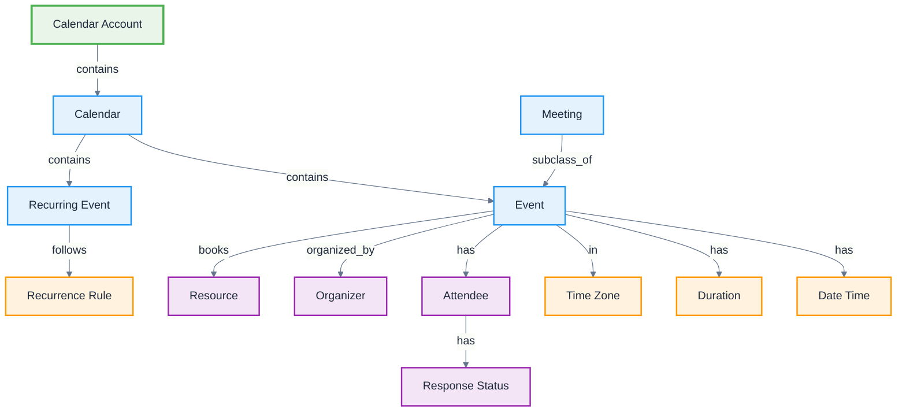

# Google Calendar

**Definition:** Application ontology for Google Calendar scheduling platform, modeling events, calendars, attendees, and time management elements.

**Parent:** [Artifact](/cco/Artifact)

**See also:** [Gmail](/applications/Gmail), [Google Meet](/applications/GoogleMeet), [Google Workspace](/applications/GoogleWorkspace)

:::note
This application ontology is not fully vetted and is subject to changes as we refine the modeling approach for third-party integrations.
:::

## Modeling Notes

- Google Calendar organizes time-based events across multiple calendar views
- Events can have complex recurrence patterns and timezone handling
- Supports multiple calendar types (personal, shared, public, resource calendars)
- Integration with Gmail enables automatic event creation from emails
- Meeting rooms and resources can be booked as part of event scheduling

## Core Classes

### **Calendar Structure**
- **Calendar Account** - User's calendar system with multiple calendars
- **Calendar** - Individual calendar container for related events
- **Event** - Scheduled occurrence with time, location, and participants
- **Recurring Event** - Event series with repetition patterns
- **All-Day Event** - Events without specific time boundaries
- **Meeting** - Events with multiple attendees and collaboration features

### **Time Elements**
- **Date Time** - Specific moment in time with timezone information
- **Time Zone** - Geographic time zone for event scheduling
- **Duration** - Length of time for events and meetings
- **Recurrence Rule** - Pattern defining event repetition
- **Free/Busy Time** - Availability information for scheduling
- **Working Hours** - Default availability periods

### **Participant Elements**
- **Attendee** - Person invited to or participating in events
- **Organizer** - Person who created and manages the event
- **Resource** - Bookable items like meeting rooms or equipment
- **Guest** - External attendee not in the organization
- **Response Status** - Attendee's reply to event invitation

## Schema Structure



## Implementation Examples

### **Calendar and Event Structure**
```turtle
@prefix gcal: <http://ontology.naas.ai/applications/google-calendar/> .
@prefix abi: <http://ontology.naas.ai/abi/> .
@prefix cco: <http://purl.obolibrary.org/obo/> .

# Calendar account
gcal:UserCalendarAccount a gcal:CalendarAccount ;
    rdfs:label "John Doe Calendar Account"@en ;
    gcal:primaryEmail "john.doe@company.com" ;
    gcal:hasCalendar gcal:PersonalCalendar,
                     gcal:WorkCalendar,
                     gcal:ProjectCalendar ;
    gcal:defaultTimeZone "America/New_York" ;
    gcal:workingHours gcal:StandardWorkHours .

# Individual calendar
gcal:WorkCalendar a gcal:Calendar ;
    rdfs:label "Work Calendar"@en ;
    gcal:calendarId "work@company.com" ;
    gcal:calendarName "Work" ;
    gcal:calendarColor "#4285f4" ;
    gcal:isPublic false ;
    gcal:canEdit true ;
    gcal:containsEvent gcal:TeamMeeting,
                       gcal:ProjectReview .
```

### **Event Details**
```turtle
# Meeting event
gcal:TeamMeeting a gcal:Meeting ;
    rdfs:label "Weekly Team Standup"@en ;
    gcal:eventId "event_12345" ;
    gcal:summary "Weekly Team Standup" ;
    gcal:description "Weekly team sync to discuss progress and blockers" ;
    gcal:startDateTime "2024-01-15T10:00:00-05:00"^^xsd:dateTime ;
    gcal:endDateTime "2024-01-15T10:30:00-05:00"^^xsd:dateTime ;
    gcal:timeZone "America/New_York" ;
    gcal:location "Conference Room A" ;
    gcal:organizer gcal:TeamLead ;
    gcal:hasAttendee gcal:Developer1,
                     gcal:Developer2,
                     gcal:Designer1 ;
    gcal:meetingLink gcal:GoogleMeetLink ;
    gcal:visibility "default" .

# Recurring event
gcal:WeeklyStandup a gcal:RecurringEvent ;
    rdfs:label "Weekly Standup Series"@en ;
    gcal:recurrenceRule gcal:WeeklyRecurrence ;
    gcal:seriesStart "2024-01-01T10:00:00-05:00"^^xsd:dateTime ;
    gcal:seriesEnd "2024-12-31T10:30:00-05:00"^^xsd:dateTime ;
    gcal:instanceCount 52 ;
    gcal:hasException gcal:HolidayException .

# Recurrence pattern
gcal:WeeklyRecurrence a gcal:RecurrenceRule ;
    rdfs:label "Every Monday at 10 AM"@en ;
    gcal:frequency "WEEKLY" ;
    gcal:interval 1 ;
    gcal:byDay "MO" ;
    gcal:count 52 .
```

### **Attendees and Resources**
```turtle
# Event attendee
gcal:Developer1 a gcal:Attendee ;
    rdfs:label "Alice Johnson"@en ;
    gcal:email "alice.johnson@company.com" ;
    gcal:displayName "Alice Johnson" ;
    gcal:responseStatus "accepted" ;
    gcal:isOptional false ;
    gcal:canModifyEvent false ;
    gcal:canInviteOthers false .

# Meeting room resource
gcal:ConferenceRoomA a gcal:Resource ;
    rdfs:label "Conference Room A"@en ;
    gcal:resourceId "room_a@company.com" ;
    gcal:resourceType "room" ;
    gcal:capacity 8 ;
    gcal:hasFeature "projector", "whiteboard", "video_conference" ;
    gcal:location "Building 1, Floor 2" ;
    gcal:isBookable true .

# Google Meet integration
gcal:GoogleMeetLink a gcal:ConferenceData ;
    rdfs:label "Google Meet Conference"@en ;
    gcal:conferenceId "meet_abc123" ;
    gcal:entryPoint "https://meet.google.com/abc-defg-hij" ;
    gcal:dialInNumber "+1-555-123-4567" ;
    gcal:accessCode "123456789" .
```

## AI Integration Patterns

### **Smart Scheduling**
- **Time Insights** - AI analysis of meeting patterns and productivity
- **Smart Scheduling** - Optimal meeting time suggestions based on availability
- **Travel Time** - Automatic buffer time for location changes
- **Focus Time** - AI-suggested blocks for concentrated work

### **Event Intelligence**
- **Meeting Insights** - Analysis of meeting effectiveness and patterns
- **Automatic Event Creation** - Extract events from Gmail messages
- **Duplicate Detection** - Identify and merge similar events
- **Conflict Resolution** - Smart handling of scheduling conflicts

### **Productivity Optimization**
- **Calendar Analytics** - Time allocation and meeting load analysis
- **Meeting Recommendations** - Suggestions for meeting optimization
- **Break Reminders** - AI-suggested rest periods
- **Goal Tracking** - Calendar-based objective monitoring

## Calendar Workflows

### **Meeting Scheduling Workflow**
```turtle
gcal:MeetingSchedulingWorkflow a abi:Workflow ;
    rdfs:label "Automated Meeting Scheduling"@en ;
    abi:hasStep gcal:AvailabilityCheck,
                gcal:RoomBooking,
                gcal:InvitationSending,
                gcal:ReminderSetup ;
    abi:involvesResource gcal:ConferenceRoom ;
    abi:notifiesAttendees gcal:MeetingInvitation .
```

### **Event Reminder System**
```turtle
gcal:ReminderWorkflow a abi:Workflow ;
    rdfs:label "Event Reminder System"@en ;
    abi:triggeredBy gcal:ReminderTime ;
    abi:sendsNotification gcal:EmailReminder,
                          gcal:PopupReminder,
                          gcal:MobileNotification ;
    abi:includesDetails gcal:EventSummary,
                        gcal:LocationInfo,
                        gcal:JoinLink .
```

## Integration Points

### **Google Services Integration**
- **Gmail Integration** - Event creation from emails, meeting invitations
- **Google Meet Integration** - Video conference links and management
- **Google Drive Integration** - Event attachments and document sharing
- **Google Contacts Integration** - Attendee information and suggestions

### **External Calendar Systems**
```turtle
gcal:ExchangeIntegration a abi:Integration ;
    rdfs:label "Google Calendar-Exchange Integration"@en ;
    abi:synchronizesData gcal:CalendarEvents,
                         abi:ExchangeEvents ;
    abi:maintainsConsistency gcal:EventUpdates ;
    abi:handlesConflicts gcal:ConflictResolution .
```

## Calendar Management

### **Multiple Calendar Support**
```turtle
# Calendar sharing and permissions
gcal:SharedCalendar a gcal:Calendar ;
    rdfs:label "Team Project Calendar"@en ;
    gcal:isShared true ;
    gcal:hasPermission gcal:TeamReadWrite,
                       gcal:ManagerFullControl ;
    gcal:sharingLevel "organization" ;
    gcal:defaultVisibility "busy" .

# Calendar subscription
gcal:HolidayCalendar a gcal:SubscribedCalendar ;
    rdfs:label "US Holidays"@en ;
    gcal:subscriptionUrl "https://calendar.google.com/calendar/ical/en.usa%23holiday%40group.v.calendar.google.com/public/basic.ics" ;
    gcal:isReadOnly true ;
    gcal:updateFrequency "daily" .
```

### **Availability Management**
```turtle
# Working hours configuration
gcal:StandardWorkHours a gcal:WorkingHours ;
    rdfs:label "Standard Work Schedule"@en ;
    gcal:mondayHours "09:00-17:00" ;
    gcal:tuesdayHours "09:00-17:00" ;
    gcal:wednesdayHours "09:00-17:00" ;
    gcal:thursdayHours "09:00-17:00" ;
    gcal:fridayHours "09:00-17:00" ;
    gcal:timeZone "America/New_York" .

# Out of office periods
gcal:VacationPeriod a gcal:OutOfOffice ;
    rdfs:label "Summer Vacation"@en ;
    gcal:startDate "2024-07-15" ;
    gcal:endDate "2024-07-26" ;
    gcal:autoDecline true ;
    gcal:responseMessage "I'm out of office until July 26th" .
```

## Analytics and Reporting

### **Calendar Analytics**
```turtle
gcal:CalendarAnalytics a abi:Analytics ;
    rdfs:label "Calendar Usage Analytics"@en ;
    abi:measuresMetric gcal:MeetingTime,
                       gcal:FocusTime,
                       gcal:TravelTime ;
    abi:providesInsights gcal:ProductivityPatterns ;
    abi:suggestsOptimizations gcal:ScheduleImprovements .
```

### **Meeting Effectiveness**
- **Meeting Duration Analysis** - Optimal meeting length recommendations
- **Attendee Engagement** - Participation pattern analysis
- **Follow-up Tracking** - Action item completion rates
- **Room Utilization** - Resource usage optimization

## See Also

- [Gmail](/applications/Gmail) - Email integration and meeting invitations
- [Google Meet](/applications/GoogleMeet) - Video conferencing integration
- [Google Workspace](/applications/GoogleWorkspace) - Complete productivity suite
- [Event](/abi/Event) - ABI event ontology foundation
