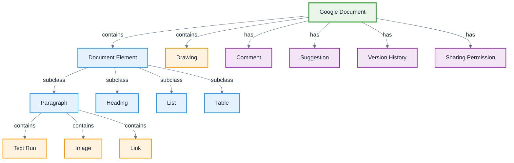

# Google Docs

**Definition:** Application ontology for Google Docs document processing platform, modeling collaborative text documents, formatting, and real-time editing features.

**Parent:** [Artifact](/cco/Artifact)

**See also:** [Google Sheets](/applications/GoogleSheets), [Google Drive](/applications/GoogleDrive), [Word](/applications/Word)

:::note
This application ontology is not fully vetted and is subject to changes as we refine the modeling approach for third-party integrations.
:::

## Modeling Notes

- Google Docs provides real-time collaborative document editing with cloud synchronization
- Documents are structured with hierarchical elements (headings, paragraphs, lists)
- Supports rich formatting, comments, suggestions, and version history
- Integration with Google Drive enables seamless file management and sharing
- Web-based with offline editing capabilities and mobile app support

## Core Classes

### **Document Structure**
- **Google Document** - Cloud-based text document with collaborative features
- **Document Element** - Basic building blocks (paragraphs, headings, lists, tables)
- **Paragraph** - Text block with consistent formatting and styling
- **Heading** - Structured document headings with hierarchy levels
- **List** - Ordered or unordered list items with nesting support
- **Table** - Structured data in rows and columns with formatting

### **Content Elements**
- **Text Run** - Continuous text with uniform character formatting
- **Image** - Embedded pictures with positioning and wrapping options
- **Link** - Hyperlinks to external resources or document sections
- **Bookmark** - Named locations within the document for navigation
- **Page Break** - Explicit page boundaries for document layout
- **Drawing** - Embedded Google Drawings with shapes and annotations

### **Collaboration Features**
- **Comment** - Collaborative annotations linked to document content
- **Suggestion** - Proposed changes in suggestion mode editing
- **Version History** - Timeline of document changes with restore capability
- **Sharing Permission** - Access levels for document collaboration
- **Real-time Cursor** - Live editing indicators showing collaborator activity

## Schema Structure



## Implementation Examples

### **Document Structure**
```turtle
@prefix gdocs: <http://ontology.naas.ai/applications/google-docs/> .
@prefix abi: <http://ontology.naas.ai/abi/> .
@prefix cco: <http://purl.obolibrary.org/obo/> .

# Google document
gdocs:ProjectProposal a gdocs:GoogleDocument ;
    rdfs:label "AI Project Proposal"@en ;
    gdocs:documentId "doc_12345" ;
    gdocs:title "AI Project Proposal - Q2 2024" ;
    gdocs:createdDate "2024-01-10T09:00:00Z"^^xsd:dateTime ;
    gdocs:lastModified "2024-01-15T16:30:00Z"^^xsd:dateTime ;
    gdocs:wordCount 2847 ;
    gdocs:pageCount 8 ;
    gdocs:hasOwner gdocs:ProjectManager ;
    gdocs:hasEditor gdocs:TechnicalLead,
                    gdocs:BusinessAnalyst ;
    gdocs:containsElement gdocs:TitleHeading,
                          gdocs:ExecutiveSummary,
                          gdocs:TechnicalSection .

# Document elements
gdocs:TitleHeading a gdocs:Heading ;
    rdfs:label "Document Title"@en ;
    gdocs:headingLevel 1 ;
    gdocs:textContent "AI Project Proposal - Q2 2024" ;
    gdocs:fontSize 20 ;
    gdocs:isBold true ;
    gdocs:alignment "center" .

gdocs:ExecutiveSummary a gdocs:Paragraph ;
    rdfs:label "Executive Summary Paragraph"@en ;
    gdocs:containsTextRun gdocs:SummaryText ;
    gdocs:paragraphStyle gdocs:BodyTextStyle ;
    gdocs:spacingAfter 12 ;
    gdocs:lineSpacing 1.15 .
```

### **Content and Formatting**
```turtle
# Text with formatting
gdocs:SummaryText a gdocs:TextRun ;
    rdfs:label "Executive summary text"@en ;
    gdocs:textContent "This proposal outlines the development of an AI-powered system..." ;
    gdocs:fontFamily "Arial" ;
    gdocs:fontSize 11 ;
    gdocs:textColor "#000000" ;
    gdocs:isBold false ;
    gdocs:isItalic false ;
    gdocs:isUnderlined false .

# Table structure
gdocs:BudgetTable a gdocs:Table ;
    rdfs:label "Project Budget Table"@en ;
    gdocs:rowCount 6 ;
    gdocs:columnCount 4 ;
    gdocs:hasTableStyle gdocs:BudgetTableStyle ;
    gdocs:containsRow gdocs:HeaderRow,
                      gdocs:DevelopmentRow,
                      gdocs:TestingRow,
                      gdocs:TotalRow .

# Embedded image
gdocs:ArchitectureDiagram a gdocs:Image ;
    rdfs:label "System Architecture Diagram"@en ;
    gdocs:imageId "img_67890" ;
    gdocs:imageUrl "https://drive.google.com/file/d/abc123/view" ;
    gdocs:width 400 ;
    gdocs:height 300 ;
    gdocs:alignment "center" ;
    gdocs:textWrapping "inline" .
```

### **Collaboration Features**
```turtle
# Document comment
gdocs:ReviewComment a gdocs:Comment ;
    rdfs:label "Technical review comment"@en ;
    gdocs:commentId "comment_11111" ;
    gdocs:commentText "The technical approach looks solid, but we should consider scalability requirements." ;
    gdocs:commentAuthor gdocs:TechnicalLead ;
    gdocs:commentDate "2024-01-14T14:20:00Z"^^xsd:dateTime ;
    gdocs:isResolved false ;
    gdocs:attachedToText "technical approach" ;
    gdocs:hasReply gdocs:AuthorReply .

# Suggested edit
gdocs:BudgetSuggestion a gdocs:Suggestion ;
    rdfs:label "Budget adjustment suggestion"@en ;
    gdocs:suggestionId "suggestion_22222" ;
    gdocs:suggestionType "replace" ;
    gdocs:originalText "$50,000" ;
    gdocs:suggestedText "$55,000" ;
    gdocs:suggestionAuthor gdocs:BusinessAnalyst ;
    gdocs:suggestionDate "2024-01-15T11:45:00Z"^^xsd:dateTime ;
    gdocs:suggestionStatus "pending" .

# Version history
gdocs:DocumentVersion a gdocs:VersionHistory ;
    rdfs:label "Version from January 14"@en ;
    gdocs:versionId "version_33333" ;
    gdocs:versionDate "2024-01-14T16:00:00Z"^^xsd:dateTime ;
    gdocs:versionAuthor gdocs:ProjectManager ;
    gdocs:changeDescription "Added technical requirements section" ;
    gdocs:isNamedVersion true ;
    gdocs:versionName "Technical Requirements Added" .
```

## AI Integration Patterns

### **Writing Assistance**
- **Smart Compose** - AI-powered writing suggestions and completions
- **Grammar Check** - Real-time grammar and style recommendations
- **Tone Suggestions** - Adjust writing tone for different audiences
- **Citation Assistance** - Automatic citation formatting and management

### **Content Intelligence**
- **Document Insights** - Reading time, complexity analysis, and readability scores
- **Topic Extraction** - Automatic identification of key themes and concepts
- **Summary Generation** - AI-generated document summaries and abstracts
- **Translation** - Real-time document translation and multilingual support

### **Collaboration Enhancement**
- **Smart Suggestions** - AI-powered editing and improvement recommendations
- **Meeting Notes** - Automatic transcription and formatting of meeting discussions
- **Action Item Detection** - Identify and extract actionable items from documents
- **Duplicate Content Detection** - Identify repeated or similar content sections

## Document Workflows

### **Collaborative Writing Workflow**
```turtle
gdocs:CollaborativeWritingWorkflow a abi:Workflow ;
    rdfs:label "Multi-author Document Creation"@en ;
    abi:hasStep gdocs:DocumentCreation,
                gdocs:ContentDrafting,
                gdocs:PeerReview,
                gdocs:FinalEditing ;
    abi:involvesCollaborator gdocs:Author,
                            gdocs:Reviewer,
                            gdocs:Editor ;
    abi:enablesFeature gdocs:RealTimeEditing,
                       gdocs:CommentSystem,
                       gdocs:SuggestionMode .
```

### **Document Approval Process**
```turtle
gdocs:DocumentApprovalWorkflow a abi:Workflow ;
    rdfs:label "Document Review and Approval"@en ;
    abi:triggeredBy gdocs:SubmissionEvent ;
    abi:requiresApproval gdocs:ManagerApproval,
                         gdocs:LegalApproval ;
    abi:tracksChanges gdocs:ApprovalHistory ;
    abi:notifiesStakeholders gdocs:ApprovalNotification .
```

## Integration Points

### **Google Workspace Integration**
- **Drive Integration** - Seamless file storage and organization
- **Gmail Integration** - Document sharing via email attachments
- **Calendar Integration** - Meeting agenda documents and note-taking
- **Sheets Integration** - Embedded spreadsheets and data visualization

### **Third-Party Integrations**
```turtle
gdocs:ZoteroIntegration a abi:Integration ;
    rdfs:label "Zotero Citation Management"@en ;
    abi:enablesFeature gdocs:CitationInsertion,
                       gdocs:BibliographyGeneration ;
    abi:synchronizesData gdocs:Citations,
                         abi:ZoteroLibrary ;
    abi:supportsFormats "APA", "MLA", "Chicago" .
```

## Document Templates and Automation

### **Template System**
```turtle
gdocs:DocumentTemplate a gdocs:Template ;
    rdfs:label "Project Proposal Template"@en ;
    gdocs:templateId "template_44444" ;
    gdocs:templateCategory "Business" ;
    gdocs:containsSection gdocs:ExecutiveSummarySection,
                          gdocs:TechnicalSection,
                          gdocs:BudgetSection ;
    gdocs:hasPlaceholder gdocs:ProjectNamePlaceholder,
                         gdocs:DatePlaceholder .
```

### **Automation Features**
- **Smart Chips** - Interactive elements for dates, people, and files
- **Table of Contents** - Automatic generation based on heading structure
- **Page Numbers** - Automatic page numbering and formatting
- **Cross-References** - Dynamic references to headings, figures, and tables

## Analytics and Insights

### **Document Analytics**
```turtle
gdocs:DocumentAnalytics a abi:Analytics ;
    rdfs:label "Document Usage Analytics"@en ;
    abi:measuresMetric gdocs:ViewCount,
                       gdocs:EditTime,
                       gdocs:CollaboratorActivity ;
    abi:providesInsights gdocs:UsagePatterns ;
    abi:suggestsOptimizations gdocs:CollaborationImprovements .
```

### **Collaboration Metrics**
- **Edit Frequency** - Document modification patterns and activity levels
- **Comment Engagement** - Collaborative feedback and discussion metrics
- **Suggestion Acceptance** - Rate of suggested changes being accepted
- **Version Activity** - Document revision and update frequency

## See Also

- [Google Sheets](/applications/GoogleSheets) - Spreadsheet application integration
- [Google Drive](/applications/GoogleDrive) - Cloud storage and file management
- [Google Workspace](/applications/GoogleWorkspace) - Complete productivity suite
- [Word](/applications/Word) - Microsoft Word document processing comparison
