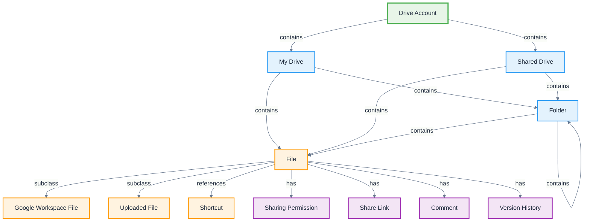

# Google Drive

**Definition:** Application ontology for Google Drive cloud storage platform, modeling files, folders, sharing, and collaborative storage management.

**Parent:** [Artifact](/cco/Artifact)

**See also:** [Google Docs](/applications/GoogleDocs), [Google Sheets](/applications/GoogleSheets), [Google Workspace](/applications/GoogleWorkspace)

:::note
This application ontology is not fully vetted and is subject to changes as we refine the modeling approach for third-party integrations.
:::

## Modeling Notes

- Google Drive provides hierarchical file and folder organization with cloud synchronization
- Files can be shared with granular permission controls and collaboration features
- Supports both Google Workspace native files and uploaded external file formats
- Version history and revision tracking enable collaborative editing workflows
- Integration with all Google Workspace applications for seamless file access

## Core Classes

### **Storage Structure**
- **Drive Account** - User's cloud storage space with quota and settings
- **My Drive** - Personal file storage area for individual users
- **Shared Drive** - Team storage area with shared ownership and management
- **Folder** - Container for organizing files and subfolders
- **File** - Individual document, image, video, or data file
- **Shortcut** - Reference link to files or folders in other locations

### **File Types**
- **Google Workspace File** - Native Google format files (Docs, Sheets, Slides)
- **Uploaded File** - External files stored in Drive (PDF, Office, images)
- **Folder** - Directory container for organizing content
- **Form Response File** - Automatically generated from Google Forms
- **Shared File** - Files with sharing permissions and collaboration features

### **Collaboration Elements**
- **Sharing Permission** - Access level granted to users (view, comment, edit)
- **Share Link** - URL for accessing shared files with permission controls
- **Comment** - Collaborative annotations on files and folders
- **Suggestion** - Proposed changes in collaborative editing
- **Version History** - Timeline of file changes and revisions

## Schema Structure



## Implementation Examples

### **Drive Structure**
```turtle
@prefix gdrive: <http://ontology.naas.ai/applications/google-drive/> .
@prefix abi: <http://ontology.naas.ai/abi/> .
@prefix cco: <http://purl.obolibrary.org/obo/> .

# Drive account
gdrive:UserDriveAccount a gdrive:DriveAccount ;
    rdfs:label "John Doe Drive Account"@en ;
    gdrive:accountEmail "john.doe@company.com" ;
    gdrive:storageUsed "8.2GB" ;
    gdrive:storageQuota "100GB" ;
    gdrive:hasMyDrive gdrive:PersonalDrive ;
    gdrive:hasSharedDrive gdrive:ProjectDrive,
                          gdrive:TeamDrive .

# Personal drive space
gdrive:PersonalDrive a gdrive:MyDrive ;
    rdfs:label "John's My Drive"@en ;
    gdrive:containsFolder gdrive:DocumentsFolder,
                          gdrive:PhotosFolder,
                          gdrive:ProjectsFolder ;
    gdrive:containsFile gdrive:ResumeDoc,
                        gdrive:BudgetSheet .

# Shared team drive
gdrive:ProjectDrive a gdrive:SharedDrive ;
    rdfs:label "AI Project Team Drive"@en ;
    gdrive:driveId "shared_drive_12345" ;
    gdrive:teamDriveName "AI Project Team" ;
    gdrive:hasManager gdrive:ProjectManager ;
    gdrive:hasMember gdrive:Developer1,
                     gdrive:Developer2,
                     gdrive:Designer1 ;
    gdrive:containsFolder gdrive:DocumentationFolder,
                          gdrive:CodeFolder .
```

### **File Organization**
```turtle
# Folder structure
gdrive:DocumentationFolder a gdrive:Folder ;
    rdfs:label "Project Documentation"@en ;
    gdrive:folderId "folder_67890" ;
    gdrive:folderName "Documentation" ;
    gdrive:parentFolder gdrive:ProjectDrive ;
    gdrive:containsFile gdrive:RequirementsDoc,
                        gdrive:ArchitectureDoc,
                        gdrive:UserGuide ;
    gdrive:hasPermission gdrive:TeamEditPermission .

# Google Workspace file
gdrive:RequirementsDoc a gdrive:GoogleDocsFile ;
    rdfs:label "Project Requirements Document"@en ;
    gdrive:fileId "doc_11111" ;
    gdrive:fileName "Project_Requirements" ;
    gdrive:mimeType "application/vnd.google-apps.document" ;
    gdrive:createdDate "2024-01-10T09:00:00Z"^^xsd:dateTime ;
    gdrive:modifiedDate "2024-01-15T14:30:00Z"^^xsd:dateTime ;
    gdrive:fileSize "0" ; # Google Docs don't count against storage
    gdrive:hasOwner gdrive:ProjectManager ;
    gdrive:hasEditor gdrive:Developer1,
                     gdrive:TechnicalWriter .

# Uploaded external file
gdrive:DesignMockup a gdrive:UploadedFile ;
    rdfs:label "UI Design Mockup"@en ;
    gdrive:fileId "file_22222" ;
    gdrive:fileName "UI_Mockup_v2.sketch" ;
    gdrive:mimeType "application/octet-stream" ;
    gdrive:fileSize "15.7MB" ;
    gdrive:uploadedBy gdrive:Designer1 ;
    gdrive:hasViewer gdrive:Developer1,
                     gdrive:ProductManager .
```

### **Sharing and Permissions**
```turtle
# Sharing permission
gdrive:TeamEditPermission a gdrive:SharingPermission ;
    rdfs:label "Team Edit Access"@en ;
    gdrive:permissionId "perm_33333" ;
    gdrive:permissionType "user" ;
    gdrive:role "writer" ;
    gdrive:grantedTo gdrive:Developer1 ;
    gdrive:canShare true ;
    gdrive:canComment true ;
    gdrive:expirationDate "2024-12-31T23:59:59Z"^^xsd:dateTime .

# Public share link
gdrive:PublicShareLink a gdrive:ShareLink ;
    rdfs:label "Public View Link"@en ;
    gdrive:linkId "link_44444" ;
    gdrive:shareUrl "https://drive.google.com/file/d/abc123/view?usp=sharing" ;
    gdrive:linkType "anyone" ;
    gdrive:linkRole "reader" ;
    gdrive:requiresAuth false ;
    gdrive:allowsDownload true .

# File comment
gdrive:ReviewComment a gdrive:Comment ;
    rdfs:label "Requirements review comment"@en ;
    gdrive:commentId "comment_55555" ;
    gdrive:commentText "This section needs more detail on the API requirements" ;
    gdrive:commentAuthor gdrive:TechnicalLead ;
    gdrive:commentDate "2024-01-14T16:20:00Z"^^xsd:dateTime ;
    gdrive:isResolved false ;
    gdrive:hasReply gdrive:CommentReply .
```

## AI Integration Patterns

### **Content Intelligence**
- **Smart Search** - AI-powered file content search and discovery
- **Auto-Classification** - Intelligent file categorization and tagging
- **Duplicate Detection** - Identify and manage duplicate files
- **Content Extraction** - Extract text and metadata from various file types

### **Collaboration Enhancement**
- **Smart Suggestions** - AI-powered sharing and collaboration recommendations
- **Activity Insights** - Analysis of file usage and collaboration patterns
- **Access Optimization** - Intelligent permission and sharing recommendations
- **Version Intelligence** - Smart version comparison and conflict resolution

### **Storage Optimization**
- **Storage Analytics** - Usage patterns and optimization suggestions
- **Cleanup Recommendations** - Identify unused or redundant files
- **Archive Suggestions** - Intelligent long-term storage recommendations
- **Quota Management** - Proactive storage limit management

## File Management Workflows

### **File Upload and Processing**
```turtle
gdrive:FileUploadWorkflow a abi:Workflow ;
    rdfs:label "File Upload and Processing"@en ;
    abi:hasStep gdrive:FileUpload,
                gdrive:VirusScan,
                gdrive:ContentAnalysis,
                gdrive:IndexingUpdate ;
    abi:processesFile gdrive:UploadedFile ;
    abi:outputsMetadata gdrive:FileMetadata .
```

### **Collaborative Editing Workflow**
```turtle
gdrive:CollaborativeEditingWorkflow a abi:Workflow ;
    rdfs:label "Real-time Collaborative Editing"@en ;
    abi:enablesFeature gdrive:RealTimeEditing,
                       gdrive:ConflictResolution,
                       gdrive:VersionTracking ;
    abi:notifiesCollaborators gdrive:EditNotification ;
    abi:maintainsHistory gdrive:RevisionHistory .
```

## Integration Points

### **Google Workspace Integration**
- **Docs/Sheets/Slides** - Native file creation and editing
- **Gmail Integration** - Email attachments and file sharing
- **Calendar Integration** - Meeting attachments and agenda files
- **Forms Integration** - Response collection and storage

### **Third-Party Applications**
```turtle
gdrive:OfficeIntegration a abi:Integration ;
    rdfs:label "Microsoft Office Integration"@en ;
    abi:enablesEditing gdrive:OfficeFiles ;
    abi:maintainsCompatibility gdrive:FileFormats ;
    abi:synchronizesChanges gdrive:OfficeEdits ;
    abi:preservesFormatting gdrive:DocumentLayout .
```

## Security and Compliance

### **Access Controls**
```turtle
gdrive:SecurityPolicy a gdrive:Policy ;
    rdfs:label "Enterprise Security Policy"@en ;
    gdrive:requiresAuthentication gdrive:TwoFactorAuth ;
    gdrive:restrictsSharing gdrive:InternalOnly ;
    gdrive:enablesAuditLogging true ;
    gdrive:enforcesDLP gdrive:DataLossPrevention .
```

### **Data Protection**
- **Encryption** - Files encrypted at rest and in transit
- **Access Logging** - Comprehensive audit trails for file access
- **Data Loss Prevention** - Automated sensitive content detection
- **Retention Policies** - Automated file lifecycle management

## Storage Analytics

### **Usage Metrics**
```turtle
gdrive:StorageAnalytics a abi:Analytics ;
    rdfs:label "Drive Storage Analytics"@en ;
    abi:measuresMetric gdrive:StorageUsage,
                       gdrive:FileActivity,
                       gdrive:SharingPatterns ;
    abi:providesInsights gdrive:UsagePatterns ;
    abi:suggestsOptimizations gdrive:StorageOptimization .
```

### **Collaboration Metrics**
- **File Sharing Frequency** - Most shared and accessed files
- **Collaboration Patterns** - Team interaction and editing patterns
- **Version Activity** - File revision and update frequency
- **Comment Engagement** - Collaborative feedback and discussion metrics

## See Also

- [Google Docs](/applications/GoogleDocs) - Document creation and editing
- [Google Sheets](/applications/GoogleSheets) - Spreadsheet application
- [Google Slides](/applications/GoogleSlides) - Presentation application
- [Google Workspace](/applications/GoogleWorkspace) - Complete productivity suite
