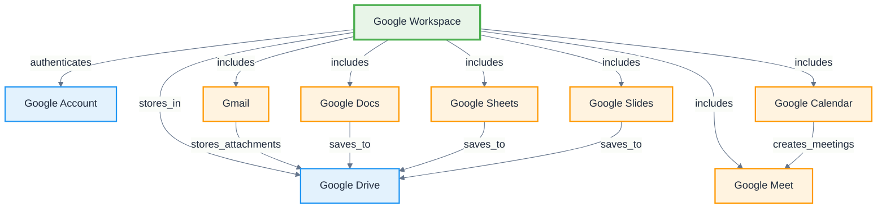

# Google Workspace

**Definition:** Application ontology for Google Workspace suite integration, including Gmail, Calendar, Drive, Docs, Sheets, Slides, and related productivity applications.

**Parent:** [Artifact](/cco/Artifact)

**See also:** [Microsoft Office](/applications/MicrosoftOffice), [Gmail](/applications/Gmail), [Google Calendar](/applications/GoogleCalendar)

:::note
This application ontology is not fully vetted and is subject to changes as we refine the modeling approach for third-party integrations.
:::

## Modeling Notes

- Google Workspace applications are cloud-native with real-time collaboration
- All applications integrate with Google accounts and shared storage (Drive)
- Strong integration between applications (Calendar events, Gmail attachments, etc.)
- Web-based with mobile app extensions
- Supports enterprise features like admin controls and security policies

## Core Applications

### **Communication & Collaboration**
- **[Gmail](/applications/Gmail)** - Email and messaging platform
- **[Google Calendar](/applications/GoogleCalendar)** - Scheduling and event management
- **[Google Meet](/applications/GoogleMeet)** - Video conferencing and meetings
- **[Google Chat](/applications/GoogleChat)** - Team messaging and collaboration

### **Productivity Applications**
- **[Google Docs](/applications/GoogleDocs)** - Document creation and editing
- **[Google Sheets](/applications/GoogleSheets)** - Spreadsheet and data analysis
- **[Google Slides](/applications/GoogleSlides)** - Presentation creation
- **[Google Forms](/applications/GoogleForms)** - Survey and form creation

### **Storage & Organization**
- **[Google Drive](/applications/GoogleDrive)** - Cloud storage and file management
- **[Google Sites](/applications/GoogleSites)** - Website creation and hosting
- **[Google Keep](/applications/GoogleKeep)** - Note-taking and task management

## Integration Architecture



## Implementation Examples

### **Workspace Integration**
```turtle
@prefix gws: <http://ontology.naas.ai/applications/google-workspace/> .
@prefix abi: <http://ontology.naas.ai/abi/> .
@prefix cco: <http://purl.obolibrary.org/obo/> .

# Google Workspace instance
gws:CompanyWorkspace a gws:GoogleWorkspace ;
    rdfs:label "Naas Company Workspace"@en ;
    gws:hasOrganization abi:NaasOrganization ;
    gws:includesApplication gws:Gmail,
                           gws:Calendar,
                           gws:Drive,
                           gws:Docs ;
    gws:hasAdminConsole gws:AdminConsole ;
    gws:userCount 150 .

# Shared drive integration
gws:ProjectDrive a gws:SharedDrive ;
    rdfs:label "AI Project Shared Drive"@en ;
    gws:containsFile gws:ProjectDoc,
                     gws:BudgetSheet,
                     gws:PresentationSlides ;
    gws:hasPermission gws:TeamAccess .
```

### **Cross-Application Workflows**
```turtle
# Email to calendar workflow
gws:MeetingScheduleWorkflow a abi:Workflow ;
    rdfs:label "Email to Calendar Meeting Workflow"@en ;
    abi:triggeredBy gws:EmailMeetingRequest ;
    abi:createsEvent gws:CalendarMeeting ;
    abi:sendsInvitation gws:MeetingInvite ;
    abi:createsMeetLink gws:GoogleMeetLink .

# Document collaboration workflow
gws:DocumentCollaboration a abi:Workflow ;
    rdfs:label "Document Collaboration Workflow"@en ;
    abi:sharesDocument gws:ProjectDoc ;
    abi:notifiesCollaborators gws:EmailNotification ;
    abi:tracksChanges gws:RevisionHistory ;
    abi:enablesComments gws:DocumentComments .
```

## AI Integration Patterns

### **Smart Compose & Suggestions**
- **Gmail Smart Compose** - AI-powered email writing assistance
- **Calendar Smart Scheduling** - Intelligent meeting time suggestions
- **Docs Smart Editing** - Grammar and style recommendations
- **Sheets Smart Fill** - Automatic data pattern completion

### **Data Analysis & Insights**
- **Gmail Insights** - Email pattern analysis and productivity metrics
- **Calendar Analytics** - Meeting efficiency and time management
- **Drive Usage Analytics** - Storage and collaboration patterns
- **Cross-App Intelligence** - Unified productivity insights

### **Automation & Integration**
- **Google Apps Script** - Custom automation and integrations
- **Workspace Add-ons** - Third-party AI tool integration
- **API Integration** - External system connectivity
- **Workflow Automation** - Process streamlining and efficiency

## Security & Administration

### **Enterprise Controls**
```turtle
gws:AdminConsole a gws:AdministrationTool ;
    rdfs:label "Google Workspace Admin Console"@en ;
    gws:managesUsers gws:UserAccounts ;
    gws:controlsAccess gws:SecurityPolicies ;
    gws:monitorsUsage gws:AuditLogs ;
    gws:configuresApps gws:ApplicationSettings .

gws:SecurityPolicy a gws:Policy ;
    rdfs:label "Data Security Policy"@en ;
    gws:requires2FA true ;
    gws:enforcesDLP gws:DataLossPrevention ;
    gws:controlsSharing gws:SharingRestrictions ;
    gws:auditAccess gws:AccessLogs .
```

### **Compliance & Governance**
- **Data Residency** - Geographic data storage controls
- **Retention Policies** - Automated data lifecycle management
- **eDiscovery** - Legal hold and search capabilities
- **Audit Logging** - Comprehensive activity monitoring

## API Integration

### **Google Workspace APIs**
```turtle
gws:WorkspaceAPI a abi:APIEndpoint ;
    rdfs:label "Google Workspace APIs"@en ;
    gws:providesAccess gws:GmailAPI,
                       gws:CalendarAPI,
                       gws:DriveAPI,
                       gws:DocsAPI ;
    gws:requiresAuthentication gws:OAuth2Token ;
    gws:supportsWebhooks gws:PushNotifications .

# Individual API endpoints
gws:GmailAPI a abi:APIEndpoint ;
    rdfs:label "Gmail API"@en ;
    gws:enablesOperations "send", "read", "search", "modify" ;
    gws:supportsScopes "gmail.readonly", "gmail.send" .
```

## Integration Examples

### **CRM Integration**
```turtle
gws:CRMIntegration a abi:Integration ;
    rdfs:label "Salesforce-Gmail Integration"@en ;
    abi:connectsSystem gws:Gmail,
                       abi:SalesforceSystem ;
    abi:synchronizesData gws:EmailThreads,
                         abi:CustomerRecords ;
    abi:enablesFeature gws:EmailTracking,
                       gws:ContactSync .
```

### **Project Management Integration**
```turtle
gws:ProjectIntegration a abi:Integration ;
    rdfs:label "Asana-Workspace Integration"@en ;
    abi:connectsSystem gws:GoogleWorkspace,
                       abi:AsanaSystem ;
    abi:createsTasksFrom gws:EmailRequests ;
    abi:schedulesDeadlines gws:CalendarEvents ;
    abi:attachesFiles gws:DriveDocuments .
```

## See Also

- [Gmail](/applications/Gmail) - Email and messaging platform
- [Google Calendar](/applications/GoogleCalendar) - Scheduling and events
- [Google Drive](/applications/GoogleDrive) - Cloud storage and files
- [Microsoft Office](/applications/MicrosoftOffice) - Alternative productivity suite
