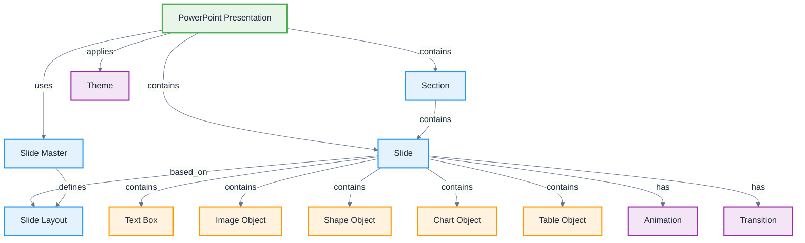

# PowerPoint

**Definition:** Application ontology for Microsoft PowerPoint presentation software, modeling slides, layouts, animations, and presentation-specific elements.

**Parent:** [Artifact](/cco/Artifact)

**See also:** [Word](/applications/Word), [Excel](/applications/Excel)

:::note
This application ontology is not fully vetted and is subject to changes as we refine the modeling approach for third-party integrations.
:::

## Modeling Notes

- PowerPoint presentations have hierarchical slide-based structure
- Each slide contains layout elements, content objects, and formatting
- Supports animations, transitions, and multimedia integration
- Presentation flow and navigation patterns are distinct from document-based applications
- Master slides and templates provide consistent formatting across presentations

## Core Classes

### **Presentation Structure**
- **PowerPoint Presentation** - Complete presentation file (.pptx, .ppt)
- **Slide** - Individual presentation slide with content
- **Slide Master** - Template defining slide layouts and formatting
- **Slide Layout** - Predefined arrangement of content placeholders
- **Section** - Logical grouping of related slides

### **Content Elements**
- **Text Box** - Text content containers with formatting
- **Image Object** - Pictures, photos, and graphics
- **Shape Object** - Geometric shapes, arrows, callouts
- **Chart Object** - Data visualizations and graphs
- **Table Object** - Structured data in rows and columns
- **Media Object** - Audio, video, and interactive content

### **Design Elements**
- **Theme** - Coordinated colors, fonts, and effects
- **Color Scheme** - Palette of coordinated colors
- **Font Scheme** - Heading and body font combinations
- **Background** - Slide background images or patterns
- **Animation** - Motion effects for content elements
- **Transition** - Effects between slide changes

## Schema Structure



## Implementation Examples

### **Presentation Structure**
```turtle
@prefix ppt: <http://ontology.naas.ai/applications/powerpoint/> .
@prefix abi: <http://ontology.naas.ai/abi/> .
@prefix cco: <http://purl.obolibrary.org/obo/> .

# Complete presentation
ppt:Q4ReviewPresentation a ppt:PowerPointPresentation ;
    rdfs:label "Q4 Business Review 2024"@en ;
    ppt:hasSlideCount 25 ;
    ppt:hasSection ppt:ExecutiveSummarySection,
                   ppt:FinancialResultsSection,
                   ppt:MarketAnalysisSection ;
    ppt:appliesTheme ppt:CorporateTheme ;
    ppt:createdBy abi:AnalystAgent ;
    ppt:lastModified "2024-01-15T14:30:00Z"^^xsd:dateTime .

# Presentation sections
ppt:ExecutiveSummarySection a ppt:Section ;
    rdfs:label "Executive Summary"@en ;
    ppt:hasSlideRange "1-5" ;
    ppt:containsSlide ppt:TitleSlide,
                      ppt:OverviewSlide,
                      ppt:KeyMetricsSlide .
```

### **Slide Content**
```turtle
# Individual slide with content
ppt:KeyMetricsSlide a ppt:Slide ;
    rdfs:label "Key Performance Metrics"@en ;
    ppt:slideNumber 3 ;
    ppt:basedOnLayout ppt:TitleAndContentLayout ;
    ppt:containsObject ppt:MetricsTitle,
                       ppt:RevenueChart,
                       ppt:GrowthTable .

# Text content
ppt:MetricsTitle a ppt:TextBox ;
    rdfs:label "Q4 Key Metrics"@en ;
    ppt:textContent "Key Performance Metrics - Q4 2024" ;
    ppt:fontSize 36 ;
    ppt:fontFamily "Calibri" ;
    ppt:position ppt:TitlePosition .

# Chart object
ppt:RevenueChart a ppt:ChartObject ;
    rdfs:label "Revenue Growth Chart"@en ;
    ppt:chartType "Column" ;
    ppt:dataSource ppt:RevenueData ;
    ppt:hasAnimation ppt:FadeInAnimation ;
    ppt:position ppt:ContentAreaPosition .
```

### **Design and Animation**
```turtle
# Theme definition
ppt:CorporateTheme a ppt:Theme ;
    rdfs:label "Corporate Theme"@en ;
    ppt:hasColorScheme ppt:CorporateColors ;
    ppt:hasFontScheme ppt:CorporateFonts ;
    ppt:hasEffectScheme ppt:CorporateEffects .

# Animation effects
ppt:FadeInAnimation a ppt:Animation ;
    rdfs:label "Fade In Effect"@en ;
    ppt:animationType "Entrance" ;
    ppt:effect "Fade" ;
    ppt:duration "0.5s" ;
    ppt:trigger "OnClick" .

# Slide transitions
ppt:SlideTransition a ppt:Transition ;
    rdfs:label "Push Transition"@en ;
    ppt:transitionType "Push" ;
    ppt:direction "FromRight" ;
    ppt:duration "1.0s" .
```

## AI Integration Patterns

### **Content Generation**
- **Slide Creation** - AI generates slides from data or outlines
- **Chart Generation** - Automatic visualization of data sets
- **Image Selection** - AI chooses appropriate images for content
- **Layout Optimization** - Intelligent arrangement of slide elements

### **Design Assistance**
- **Theme Recommendation** - AI suggests appropriate themes
- **Color Harmony** - Intelligent color scheme generation
- **Font Pairing** - Optimal font combinations for readability
- **Animation Timing** - Coordinated animation sequences

### **Content Analysis**
- **Presentation Flow** - Analyze logical progression of slides
- **Readability Assessment** - Text density and clarity analysis
- **Accessibility Check** - Compliance with accessibility standards
- **Brand Consistency** - Ensure adherence to brand guidelines

## Presentation Workflows

### **Collaborative Creation**
```turtle
ppt:CollaborativeWorkflow a abi:Workflow ;
    rdfs:label "Presentation Collaboration Workflow"@en ;
    abi:hasStep ppt:ContentOutline,
                ppt:SlideCreation,
                ppt:DesignReview,
                ppt:FinalApproval ;
    abi:involvesPerson abi:ContentCreator,
                       abi:Designer,
                       abi:Reviewer .
```

### **Automated Updates**
```turtle
ppt:DataRefreshWorkflow a abi:Workflow ;
    rdfs:label "Chart Data Refresh Workflow"@en ;
    abi:triggeredBy abi:DataUpdateEvent ;
    abi:updatesObject ppt:RevenueChart,
                      ppt:MetricsTable ;
    abi:notifies abi:PresentationOwner .
```

## Integration Points

### **Data Sources**
- **Excel Integration** - Charts linked to Excel data
- **Database Connections** - Live data feeds for charts
- **Web APIs** - Real-time data integration
- **SharePoint Lists** - Collaborative data sources

### **Export Formats**
- **PDF Export** - Static document format
- **Video Export** - Recorded presentation with narration
- **Web Format** - Online presentation viewing
- **Image Export** - Individual slides as images

## See Also

- [Word](/applications/Word) - Document processing application
- [Excel](/applications/Excel) - Spreadsheet application  
- [Information Object](/cco/InformationObject) - CCO information modeling
- [Design Patterns](/design-patterns) - Reusable modeling patterns
