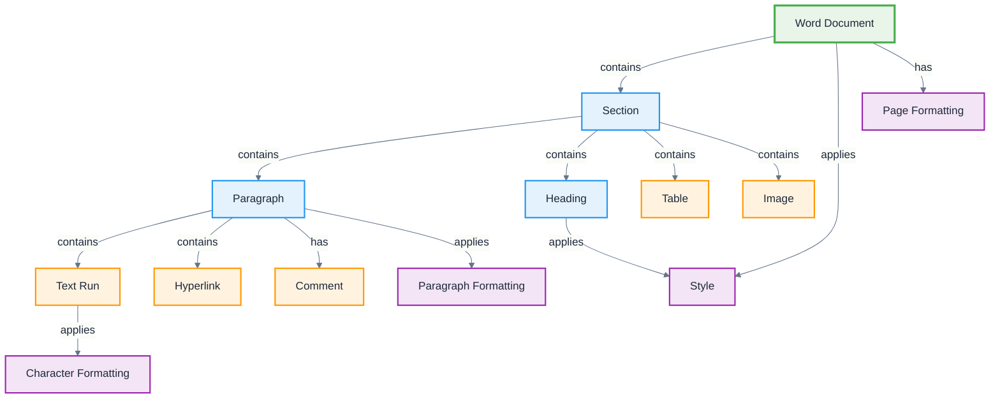

# Word

**Definition:** Application ontology for Microsoft Word document processing, modeling text documents, formatting, styles, and document-specific elements.

**Parent:** [Artifact](/cco/Artifact)

**See also:** [PowerPoint](/applications/PowerPoint), [Excel](/applications/Excel)

:::note
This application ontology is not fully vetted and is subject to changes as we refine the modeling approach for third-party integrations.
:::

## Modeling Notes

- Word documents have linear, flow-based text structure with hierarchical sections
- Document elements include paragraphs, headings, tables, images, and embedded objects
- Supports complex formatting, styles, templates, and collaborative editing
- Document structure is based on content flow rather than fixed layouts
- Version control and track changes enable collaborative document workflows

## Core Classes

### **Document Structure**
- **Word Document** - Complete document file (.docx, .doc)
- **Section** - Document sections with distinct formatting
- **Paragraph** - Basic text unit with consistent formatting
- **Heading** - Structured document headings (H1-H6)
- **Page** - Physical page boundaries and layout
- **Header/Footer** - Repeating content at page margins

### **Content Elements**
- **Text Run** - Continuous text with uniform formatting
- **Table** - Structured data in rows and columns
- **Image** - Embedded pictures and graphics
- **Shape** - Drawing objects and text boxes
- **Hyperlink** - Links to external resources
- **Footnote/Endnote** - Reference annotations
- **Comment** - Collaborative annotations
- **Bookmark** - Named document locations

### **Formatting Elements**
- **Style** - Named formatting definitions
- **Character Formatting** - Font, size, color, effects
- **Paragraph Formatting** - Alignment, spacing, indentation
- **Page Formatting** - Margins, orientation, size
- **List Formatting** - Numbered and bulleted lists
- **Table Formatting** - Borders, shading, cell properties

## Schema Structure



## Implementation Examples

### **Document Structure**
```turtle
@prefix word: <http://ontology.naas.ai/applications/word/> .
@prefix abi: <http://ontology.naas.ai/abi/> .
@prefix cco: <http://purl.obolibrary.org/obo/> .

# Complete document
word:ContractDocument a word:WordDocument ;
    rdfs:label "Service Agreement Contract"@en ;
    word:hasPageCount 12 ;
    word:hasWordCount 3456 ;
    word:hasSection word:IntroSection,
                    word:TermsSection,
                    word:SignatureSection ;
    word:appliesTemplate word:LegalTemplate ;
    word:createdBy abi:LegalAgent ;
    word:lastModified "2024-01-15T16:45:00Z"^^xsd:dateTime .

# Document sections
word:TermsSection a word:Section ;
    rdfs:label "Terms and Conditions"@en ;
    word:sectionNumber 2 ;
    word:containsParagraph word:PaymentTerms,
                          word:DeliveryTerms,
                          word:LiabilityClause .
```

### **Content Elements**
```turtle
# Paragraph with formatting
word:PaymentTerms a word:Paragraph ;
    rdfs:label "Payment Terms Paragraph"@en ;
    word:containsTextRun word:PaymentText ;
    word:appliesStyle word:BodyTextStyle ;
    word:hasIndentation "0.5in" ;
    word:hasSpacingAfter "6pt" .

# Text with character formatting
word:PaymentText a word:TextRun ;
    rdfs:label "Payment terms text"@en ;
    word:textContent "Payment shall be due within thirty (30) days of invoice date." ;
    word:fontFamily "Times New Roman" ;
    word:fontSize 12 ;
    word:isBold false ;
    word:isItalic false .

# Table structure
word:PricingTable a word:Table ;
    rdfs:label "Service Pricing Table"@en ;
    word:hasRowCount 5 ;
    word:hasColumnCount 3 ;
    word:hasHeader word:TableHeader ;
    word:containsRow word:ServiceRow1,
                     word:ServiceRow2 .
```

### **Collaborative Elements**
```turtle
# Comments and track changes
word:ReviewComment a word:Comment ;
    rdfs:label "Legal review comment"@en ;
    word:commentText "Consider adding force majeure clause" ;
    word:commentAuthor abi:LegalReviewer ;
    word:commentDate "2024-01-14T10:30:00Z"^^xsd:dateTime ;
    word:attachedToParagraph word:LiabilityClause .

# Tracked changes
word:TextRevision a word:TrackedChange ;
    rdfs:label "Liability clause revision"@en ;
    word:changeType "Insertion" ;
    word:changedText "except in cases of gross negligence" ;
    word:changeAuthor abi:LegalEditor ;
    word:changeDate "2024-01-14T14:20:00Z"^^xsd:dateTime .
```

## AI Integration Patterns

### **Content Generation**
- **Document Drafting** - AI generates initial document content
- **Template Population** - Automatic filling of document templates
- **Contract Generation** - Legal document creation from parameters
- **Report Writing** - Structured report generation from data

### **Content Analysis**
- **Document Summarization** - Extract key points and summaries
- **Readability Analysis** - Assess document complexity and clarity
- **Compliance Checking** - Verify adherence to standards and regulations
- **Plagiarism Detection** - Content originality verification

### **Editing Assistance**
- **Grammar Checking** - Advanced grammar and style suggestions
- **Tone Analysis** - Assess document tone and adjust for audience
- **Translation** - Multi-language document processing
- **Formatting Optimization** - Consistent style application

## Document Workflows

### **Review and Approval**
```turtle
word:DocumentReviewWorkflow a abi:Workflow ;
    rdfs:label "Document Review and Approval"@en ;
    abi:hasStep word:InitialDraft,
                word:PeerReview,
                word:LegalReview,
                word:FinalApproval ;
    abi:involvesPerson abi:Author,
                       abi:PeerReviewer,
                       abi:LegalReviewer,
                       abi:Approver .
```

### **Version Control**
```turtle
word:VersionControlWorkflow a abi:Workflow ;
    rdfs:label "Document Version Management"@en ;
    abi:managesVersions word:ContractV1,
                        word:ContractV2,
                        word:ContractFinal ;
    abi:trackChanges word:TextRevision ;
    abi:maintainsHistory word:ChangeLog .
```

## Integration Points

### **Data Sources**
- **Excel Integration** - Embedded spreadsheets and charts
- **Database Mail Merge** - Personalized document generation
- **SharePoint Integration** - Collaborative document storage
- **CRM Integration** - Customer data integration

### **Export Formats**
- **PDF Export** - Static document preservation
- **HTML Export** - Web-compatible format
- **Plain Text** - Content extraction without formatting
- **XML/DOCX** - Structured document format

## Security and Compliance

### **Document Protection**
- **Password Protection** - Document access control
- **Digital Signatures** - Document authenticity verification
- **Information Rights Management** - Usage restrictions
- **Watermarking** - Document identification and protection

### **Audit and Compliance**
- **Change Tracking** - Complete revision history
- **Access Logging** - Document access monitoring
- **Retention Policies** - Automated document lifecycle management
- **Compliance Templates** - Industry-specific document standards

## See Also

- [PowerPoint](/applications/PowerPoint) - Presentation application
- [Excel](/applications/Excel) - Spreadsheet application
- [Information Object](/cco/InformationObject) - CCO information modeling
- [PDF](/applications/PDF) - Document format integration
