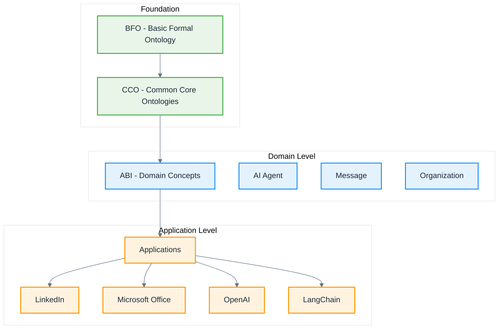

# Applications

**Applications** provide ontological models for specific third-party systems, platforms, and tools that integrate with the ABI ecosystem. These application-level ontologies extend ABI domain concepts for concrete implementations.

:::note
Application ontologies in this section are not fully vetted and are subject to changes as we refine the modeling approach for third-party integrations.
:::

## Application Categories

### **Microsoft Office Suite**
- **[Microsoft Office](/applications/MicrosoftOffice)** - Complete Office suite integration
- **[Word](/applications/Word)** - Document processing with text-based schema
- **[Excel](/applications/Excel)** - Spreadsheet application with cell-based schema
- **[PowerPoint](/applications/PowerPoint)** - Presentation application with slide-based schema

### **Google Workspace Suite**
- **[Google Workspace](/applications/GoogleWorkspace)** - Complete Google productivity suite
- **[Gmail](/applications/Gmail)** - Email platform with conversation threading
- **[Google Calendar](/applications/GoogleCalendar)** - Scheduling and event management
- **[Google Drive](/applications/GoogleDrive)** - Cloud storage and file collaboration
- **[Google Docs](/applications/GoogleDocs)** - Document creation and collaborative editing
- **[Google Sheets](/applications/GoogleSheets)** - Spreadsheet and data analysis
- **[Google Slides](/applications/GoogleSlides)** - Presentation creation and sharing

### **Professional Networks**
- **[LinkedIn](/applications/LinkedIn)** - Professional networking and career data
- **[GitHub](/applications/GitHub)** - Code repositories and development workflows

### **AI & ML Platforms**
- **[OpenAI](/applications/OpenAI)** - GPT models and API integration
- **[LangChain](/applications/LangChain)** - AI application framework
- **[Hugging Face](/applications/HuggingFace)** - Model hub and transformers

### **Communication Platforms**
- **[Slack](/applications/Slack)** - Team communication and collaboration
- **[Discord](/applications/Discord)** - Community and voice communication
- **[Email](/applications/Email)** - Email systems and protocols

### **Development Tools**
- **[OpenAPI](/applications/OpenAPI)** - API specification and documentation
- **[Docker](/applications/Docker)** - Containerization and deployment
- **[Kubernetes](/applications/Kubernetes)** - Container orchestration

### **Data Platforms**
- **[Foundry](/applications/Foundry)** - Data platform integration
- **[Data Sources](/applications/DataSource)** - Generic data source patterns

## Architecture

Applications extend the ontological hierarchy:

## Integration Patterns

### **Data Integration**
Applications typically extend ABI data concepts:
- **Data Sources** - Application-specific data access patterns
- **Information Objects** - Application document types
- **Message Types** - Application communication protocols

### **Agent Integration**
Applications extend ABI agent concepts:
- **Application Agents** - Platform-specific AI agents
- **User Agents** - Human users within applications
- **System Agents** - Automated application processes

### **Process Integration**
Applications extend ABI process concepts:
- **Application Workflows** - Platform-specific processes
- **Integration Events** - Cross-application triggers
- **Synchronization Processes** - Data consistency operations

## Implementation Guidelines

### **Naming Conventions**
- Use PascalCase for class names (e.g., `LinkedInProfilePage`)
- Prefix with application namespace (e.g., `linkedin:`, `office:`)
- Extend appropriate ABI domain classes

### **Documentation Standards**
- Include practical examples for each application class
- Document API integration patterns
- Provide authentication and authorization guidance
- Reference official application documentation

## See Also

- [ABI](/abi) - Core domain-level ontologies
- [Design Patterns](/design-patterns) - Reusable modeling patterns
- [Data Source](/applications/DataSource) - Generic data integration patterns
- [Foundry](/applications/Foundry) - Data platform integration
