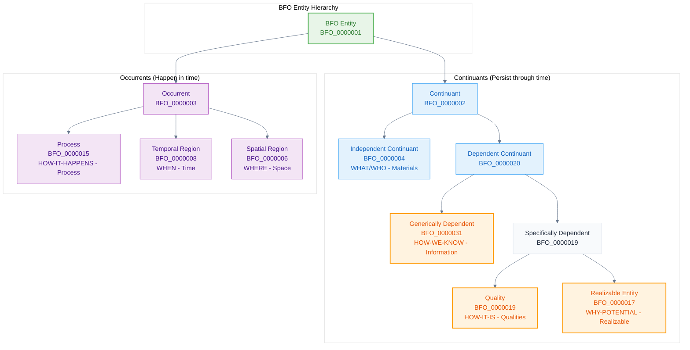

# Basic Formal Ontology (BFO) - Slim

The **BFO Slim** provides the essential foundational framework for the Naas Ontology. This is a focused subset of [BFO 2020](https://github.com/bfo-ontology) containing only the core classes needed for AI agent and system modeling.

## BFO 7 Buckets Framework

BFO organizes reality using the mnemonic: *"What and who are the materials, how-they-are their qualities, why they can do something are realizable, how-it-happens is the process, when and where give time and space, and how-we-know is the information."*

## Navigation Guide

- **[Continuant](/bfo/continuant)** - Entities that persist through time
- **[Occurrent](/bfo/occurrent)** - Entities that happen in time (includes spatial & temporal regions)
- **[Relations](/bfo/relations)** - Fundamental connections between entities

## See Also

- [Ontology Essentials - Top-Level](/ontology-essentials/top-level) - Detailed BFO implementation in Naas
- [CCO Extensions](/cco) - Mid-level concepts building on BFO
- [Process-Centric Routing](/ontology-essentials/process-routing) - BFO-based AI routing
