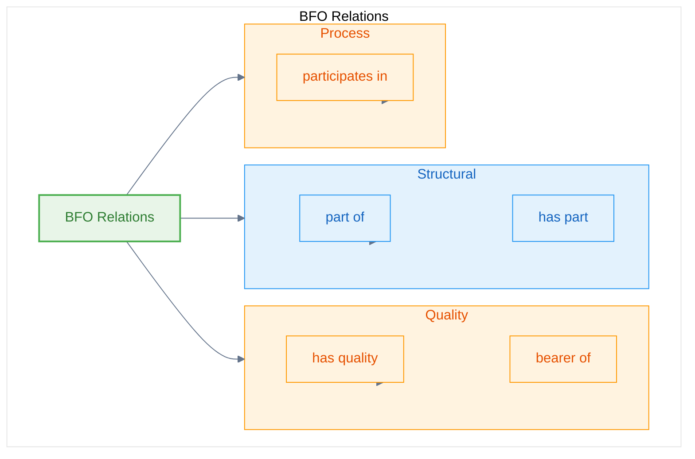

# BFO Relations Overview

**Definition:** Fundamental relations that connect entities across the BFO hierarchy, providing the logical structure for ontological relationships.

**Parent:** [BFO](/bfo)

**See also:** [Continuant](/bfo/continuant), [Occurrent](/bfo/occurrent)

## Modeling Notes

- Relations are the logical connectors between BFO entities
- Provide systematic ways to express dependencies, participation, and structural relationships
- Essential for building coherent ontological models
- Form the backbone of process-centric reasoning in AI systems

## Core Relation Categories

### Structural Relations
- **[Part Of](/bfo/relations/PartOf)** - Fundamental mereological relationship
- **[Has Part](/bfo/relations/HasPart)** - Inverse of part-of relationship

### Quality Relations  
- **[Has Quality](/bfo/relations/HasQuality)** - Entity to quality relationship
- **[Bearer Of](/bfo/relations/BearerOf)** - Quality bearer relationship

### Process Relations
- **[Participates In](/bfo/relations/ParticipatesIn)** - Entity participation in processes

## Relation Hierarchy

## Usage in AI Systems

BFO relations are essential for AI ontological reasoning:

- **Process Participation** - How AI agents participate in cognitive processes
- **Quality Attribution** - How AI systems have performance qualities
- **Structural Composition** - How AI systems are composed of parts
- **Dependency Modeling** - How AI processes depend on resources and capabilities
