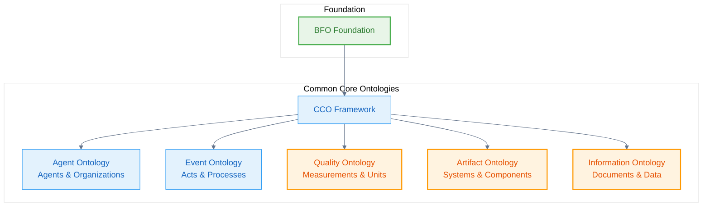

# Common Core Ontologies (CCO)

The **Common Core Ontologies (CCO)** extend BFO with mid-level concepts that are common across many domains. The Naas Ontology incorporates and extends CCO with AI-specific concepts.

## CCO Architecture

CCO provides systematic extensions of BFO with practical, reusable concepts:

## Core CCO Concepts

### Agents and Organizations
- **[Agent](/cco/Agent)** - Entities capable of performing actions
- **[Organization](/cco/Organization)** - Collective agents with shared goals

### Information and Planning
- **[Information Object](/cco/InformationObject)** - Information-bearing entities and content
- **[Plan](/cco/Plan)** - Specifications for achieving objectives
- **[Process Regulation](/cco/ProcessRegulation)** - Governance and control directives

### Capabilities and Roles
- **[Capability](/cco/Capability)** - Agent capabilities and competencies
- **[Role](/cco/Role)** - Context-dependent agent responsibilities

### Events and Activities
- **[Event](/cco/Event)** - Bounded processes of significance
- **[Act](/cco/Act)** - Agent-driven events and activities
- **[Social Act](/cco/SocialAct)** - Multi-agent social interactions
- **[Act of Association](/cco/ActOfAssociation)** - Agent partnerships and collaborations
- **[Act of Employment](/cco/ActOfEmployment)** - Employment relationship establishment

### Qualities and Artifacts
- **[Quality](/cco/Quality)** - Properties and characteristics of entities
- **[Artifact](/cco/Artifact)** - Human-made objects and systems

## See Also

- [Ontology Essentials - Mid-Level](/ontology-essentials/mid-level) - Detailed CCO implementation
- [BFO Foundation](/bfo) - Underlying ontological framework
- [ABI](/abi) - AI-specific extensions of CCO concepts
