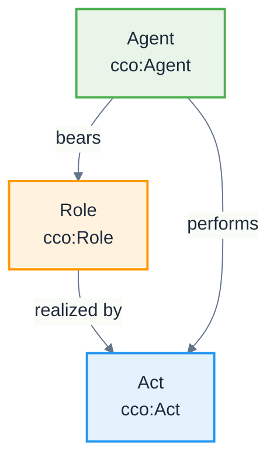

# Agent-Role Pattern

**Pattern Type:** CCO Structural Pattern  
**Domain:** Agent modeling and organizational structures  
**Based on:** [CCO Design Patterns](https://github.com/giacomodecolle/CCO-design-patterns)

## Problem

How do we model the relationship between agents and the roles they can bear and realize in different contexts?

## Solution

Use the CCO Agent-Role pattern where:
- **Agents** are material entities capable of performing actions
- **Roles** are realizable entities that inhere in agents
- **Role Realization** occurs when agents perform actions that fulfill role specifications

## Pattern Structure



## Implementation

### Core Classes
- **[Agent](/cco/Agent)** - Entity capable of performing actions
- **[Role](/cco/Role)** - Realizable entity that defines responsibilities
- **[Act](/cco/Act)** - Process that realizes roles

### Key Relations
- `cco:bearer_of` - Agent bears Role
- `cco:realizes` - Act realizes Role  
- `cco:agent_in` - Agent participates in Act

## AI Context Examples

### AI Agent Roles
```turtle
@prefix abi: <http://ontology.naas.ai/abi/> .
@prefix cco: <http://purl.obolibrary.org/obo/> .

# AI Agent bearing multiple roles
abi:ChatGPT a abi:AIAgent ;
    cco:bearer_of abi:ConversationalRole,
                  abi:ReasoningRole,
                  abi:CodeGenerationRole .

# Role realization through acts
abi:ConversationAct a cco:Act ;
    cco:realizes abi:ConversationalRole ;
    cco:agent_in abi:ChatGPT .
```

### Organizational Roles
```turtle
# Human agent in AI organization
abi:DataScientist a cco:Agent ;
    cco:bearer_of abi:DataAnalysisRole,
                  abi:ModelTrainingRole .

# Role realization
abi:ModelTrainingAct a cco:Act ;
    cco:realizes abi:ModelTrainingRole ;
    cco:agent_in abi:DataScientist .
```

## Benefits

1. **Flexibility** - Agents can bear multiple roles simultaneously
2. **Context Sensitivity** - Roles can be context-dependent
3. **Temporal Dynamics** - Agents can acquire/lose roles over time
4. **Organizational Modeling** - Supports complex organizational structures

## Related Patterns

- [Realizable Entity Pattern](/design-patterns/realizable-entity-pattern)
- [Organization Structure Pattern](/design-patterns/organization-structure-pattern)
- [Information Object Pattern](/design-patterns/information-object-pattern)

## See Also

- [Agent](/cco/Agent) - CCO Agent class
- [Role](/cco/Role) - CCO Role class  
- [AIAgent](/abi/AIAgent) - ABI AI Agent extension
