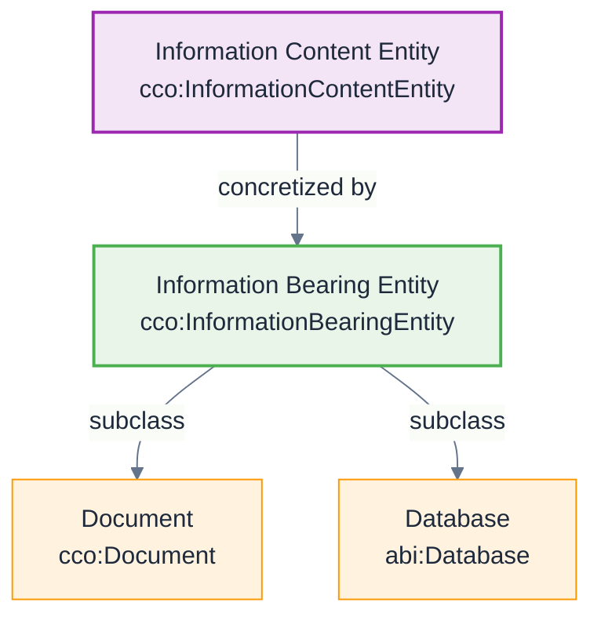

# Information Object Pattern

**Pattern Type:** CCO Information Pattern  
**Domain:** Information modeling and knowledge representation  
**Based on:** [CCO Design Patterns](https://github.com/giacomodecolle/CCO-design-patterns)

## Problem

How do we model information content that can be concretized in multiple material forms while maintaining its identity and meaning?

## Solution

Use the CCO Information Object pattern where:
- **Information Content Entities** represent abstract information
- **Information Bearing Entities** are material objects that concretize information
- **Concretization Relations** link abstract content to material bearers

## Pattern Structure



## Implementation

### Core Classes
- **[Information Object](/cco/InformationObject)** - Abstract information content
- **Information Bearing Entity** - Material objects that bear information
- **[Document](/cco/Document)** - Specific type of information bearer

### Key Relations
- `cco:concretizes` - Information Bearing Entity concretizes Information Content Entity
- `cco:describes` - Information Content Entity describes some entity
- `cco:has_part` - Information objects can have information parts

## AI Context Examples

### Knowledge Graphs
```turtle
@prefix abi: <http://ontology.naas.ai/abi/> .
@prefix cco: <http://purl.obolibrary.org/obo/> .

# Abstract knowledge representation
abi:AIKnowledgeBase a cco:InformationContentEntity ;
    rdfs:label "AI Knowledge Base"@en ;
    cco:describes abi:AIAgentCapabilities .

# Material concretizations
abi:KnowledgeGraphDB a abi:Database ;
    cco:concretizes abi:AIKnowledgeBase .

abi:KnowledgeGraphJSON a cco:Document ;
    cco:concretizes abi:AIKnowledgeBase .
```

### Training Data
```turtle
# Abstract training dataset
abi:ConversationDataset a cco:InformationContentEntity ;
    rdfs:label "Conversation Training Dataset"@en ;
    cco:describes abi:ConversationalPatterns .

# Material storage forms
abi:TrainingDataFiles a cco:Document ;
    cco:concretizes abi:ConversationDataset .

abi:TrainingDataWarehouse a abi:DataSource ;
    cco:concretizes abi:ConversationDataset .
```

### Model Specifications
```turtle
# Abstract model architecture
abi:TransformerArchitecture a cco:InformationContentEntity ;
    rdfs:label "Transformer Architecture Specification"@en ;
    cco:describes abi:NeuralNetworkStructure .

# Concrete implementations
abi:ModelConfigFile a cco:Document ;
    cco:concretizes abi:TransformerArchitecture .

abi:TrainedModelWeights a abi:Artifact ;
    cco:concretizes abi:TransformerArchitecture .
```

## Benefits

1. **Abstraction** - Separates information content from its material form
2. **Reusability** - Same information can be concretized in multiple ways
3. **Versioning** - Different versions can concretize the same abstract content
4. **Interoperability** - Supports information exchange across systems

## Variations

### Hierarchical Information
Information objects can have parts that are also information objects:

```turtle
abi:AISystemDocumentation a cco:InformationContentEntity ;
    cco:has_part abi:ArchitectureSpec,
                 abi:APIDocumentation,
                 abi:UserManual .
```

### Temporal Information
Information objects can describe temporal entities:

```turtle
abi:ProcessLog a cco:InformationContentEntity ;
    cco:describes abi:ModelTrainingProcess ;
    cco:has_temporal_part abi:EpochLog1,
                          abi:EpochLog2 .
```

## Related Patterns

- [Agent-Role Pattern](/design-patterns/agent-role-pattern)
- [Event-Process Pattern](/design-patterns/event-process-pattern)
- [Quality-Measurement Pattern](/design-patterns/quality-measurement-pattern)

## See Also

- [Information Object](/cco/InformationObject) - CCO Information Object class
- [Plan](/cco/Plan) - CCO Plan as information object
- [Message](/abi/Message) - ABI Message as information content
