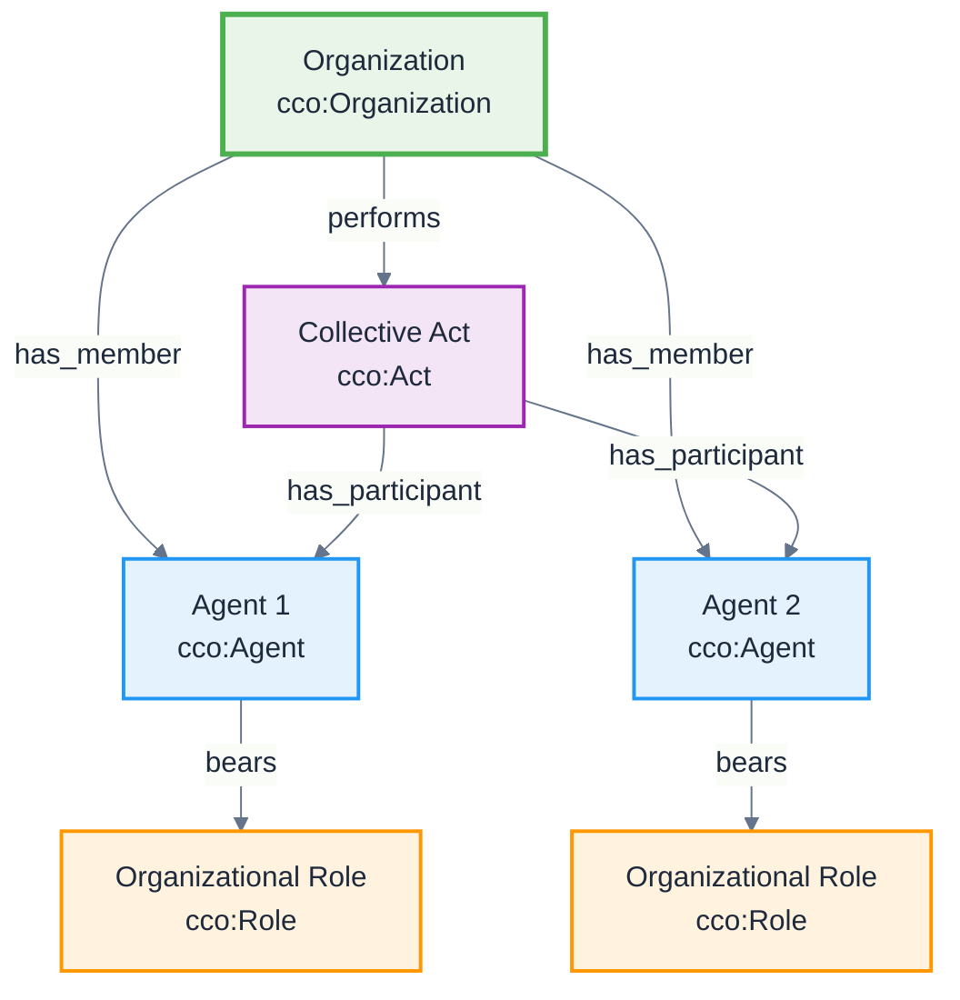

# Organization Structure Pattern

**Pattern Type:** CCO Organizational Pattern  
**Domain:** Organizational modeling and collective agents  
**Based on:** [CCO Design Patterns](https://github.com/giacomodecolle/CCO-design-patterns)

## Problem

How do we model complex organizational structures with hierarchies, memberships, and collective decision-making processes?

## Solution

Use the CCO Organization Structure pattern where:
- **Organizations** are collective agents composed of multiple agents
- **Membership Relations** define agent participation in organizations
- **Organizational Roles** specify responsibilities within the organization
- **Collective Acts** represent organizational decision-making and actions

## Pattern Structure



## Implementation

### Core Classes
- **[Organization](/cco/Organization)** - Collective agent with shared purpose
- **[Agent](/cco/Agent)** - Individual agents within organization
- **[Role](/cco/Role)** - Organizational roles and responsibilities
- **[Act](/cco/Act)** - Collective organizational actions

### Key Relations
- `cco:has_member` - Organization has member agents
- `cco:bearer_of` - Agents bear organizational roles
- `cco:agent_in` - Agents participate in collective acts
- `cco:part_of` - Sub-organizations are parts of larger organizations

## AI Context Examples

### AI Research Organization
```turtle
@prefix abi: <http://ontology.naas.ai/abi/> .
@prefix cco: <http://purl.obolibrary.org/obo/> .

# AI Research Lab
abi:OpenAI a cco:Organization ;
    rdfs:label "OpenAI"@en ;
    cco:has_member abi:ResearchScientist1,
                   abi:MLEngineer1,
                   abi:ProductManager1 .

# Organizational roles
abi:ChiefScientistRole a cco:Role ;
    rdfs:label "Chief Scientist Role"@en .

abi:ResearchScientist1 a cco:Agent ;
    cco:bearer_of abi:ChiefScientistRole .

# Collective decision-making
abi:ModelReleaseDecision a cco:Act ;
    rdfs:label "Model Release Decision"@en ;
    cco:agent_in abi:OpenAI ;
    cco:has_participant abi:ResearchScientist1,
                        abi:ProductManager1 .
```

### Multi-Agent AI System
```turtle
# AI Agent Collective
abi:AIAgentSwarm a abi:Organization ;
    rdfs:label "AI Agent Swarm"@en ;
    cco:has_member abi:CoordinatorAgent,
                   abi:WorkerAgent1,
                   abi:WorkerAgent2 .

# Specialized roles
abi:CoordinatorRole a cco:Role ;
    rdfs:label "Swarm Coordinator Role"@en .

abi:WorkerRole a cco:Role ;
    rdfs:label "Worker Agent Role"@en .

abi:CoordinatorAgent a abi:AIAgent ;
    cco:bearer_of abi:CoordinatorRole .

abi:WorkerAgent1 a abi:AIAgent ;
    cco:bearer_of abi:WorkerRole .

# Collective task execution
abi:SwarmTaskExecution a cco:Act ;
    cco:agent_in abi:AIAgentSwarm ;
    cco:has_participant abi:CoordinatorAgent,
                        abi:WorkerAgent1,
                        abi:WorkerAgent2 .
```

### Hierarchical Organization
```turtle
# Parent organization
abi:TechCorporation a cco:Organization ;
    rdfs:label "Technology Corporation"@en ;
    cco:has_part abi:AIResearchDivision,
                 abi:ProductDevelopmentDivision .

# Sub-organizations
abi:AIResearchDivision a cco:Organization ;
    rdfs:label "AI Research Division"@en ;
    cco:part_of abi:TechCorporation ;
    cco:has_member abi:AIResearcher1,
                   abi:AIResearcher2 .

# Cross-organizational collaboration
abi:ProductLaunchProject a cco:Act ;
    cco:has_participant abi:AIResearchDivision,
                        abi:ProductDevelopmentDivision .
```

## Benefits

1. **Scalability** - Models organizations of any size and complexity
2. **Hierarchy Support** - Handles nested organizational structures
3. **Role Flexibility** - Agents can have multiple roles across organizations
4. **Collective Agency** - Organizations can act as unified agents
5. **Dynamic Membership** - Supports changing organizational membership

## Variations

### Temporary Organizations
Organizations formed for specific projects:

```turtle
abi:ProjectTeam a cco:Organization ;
    rdfs:label "AI Model Development Team"@en ;
    cco:has_temporal_part abi:ProjectDuration ;
    cco:has_member abi:TempMember1,
                   abi:TempMember2 .
```

### Virtual Organizations
Distributed organizations without physical location:

```turtle
abi:VirtualAICollaborative a cco:Organization ;
    rdfs:label "Virtual AI Research Collaborative"@en ;
    cco:has_member abi:RemoteResearcher1,
                   abi:RemoteResearcher2 ;
    cco:located_in abi:CyberSpace .
```

## Related Patterns

- [Agent-Role Pattern](/design-patterns/agent-role-pattern)
- [Information Object Pattern](/design-patterns/information-object-pattern)
- [Event-Process Pattern](/design-patterns/event-process-pattern)

## See Also

- [Organization](/cco/Organization) - CCO Organization class
- [Agent](/cco/Agent) - CCO Agent class
- [Act of Association](/cco/ActOfAssociation) - Forming organizational relationships
- [Act of Employment](/cco/ActOfEmployment) - Employment within organizations
