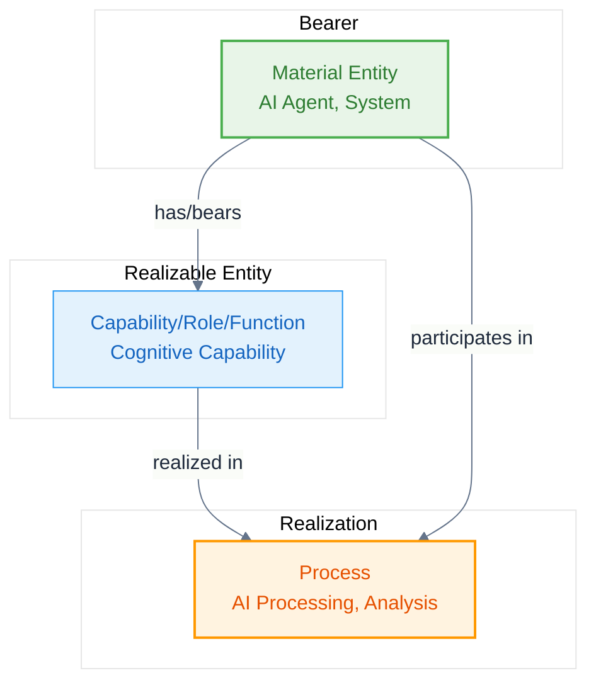

# Realizable Entity Pattern

The **Realizable Entity Pattern** is a fundamental modeling pattern for capabilities, roles, and functions that can be realized through processes.

## Pattern Structure



## Usage Guidelines

### When to Use
- Modeling capabilities that agents can have
- Representing roles that can be filled
- Defining functions that can be performed
- Specifying potentials that can be actualized

### Key Relations
- `bfo:BFO_0000087` (has role) - relates bearer to role
- `bfo:BFO_0000066` (realizes) - relates process to realizable entity
- `bfo:BFO_0000057` (has participant) - relates process to bearer

## Examples in AI Context

### Cognitive Capability Pattern
```turtle
# AI Agent with cognitive capability
abi:claude_agent a abi:AIAgent ;
    bfo:BFO_0000087 abi:ethical_reasoning_capability .

# Capability definition
abi:ethical_reasoning_capability a abi:CognitiveCapability ;
    rdfs:label "Ethical Reasoning Capability" .

# Process that realizes the capability
abi:ethical_analysis_process a abi:EthicalReasoning ;
    bfo:BFO_0000057 abi:claude_agent ;
    bfo:BFO_0000066 abi:ethical_reasoning_capability .
```

### Agent Role Pattern
```turtle
# AI Agent with specialized role
abi:grok_agent a abi:AIAgent ;
    bfo:BFO_0000087 abi:truth_seeker_role .

# Role definition
abi:truth_seeker_role a abi:AgentRole ;
    rdfs:label "Truth-Seeking Analyst Role" .

# Process that realizes the role
abi:bias_analysis_process a abi:TruthSeekingAnalysis ;
    bfo:BFO_0000057 abi:grok_agent ;
    bfo:BFO_0000066 abi:truth_seeker_role .
```

## Best Practices

1. **Clear Bearer-Realizable Relationship** - Always specify what entity bears the realizable entity
2. **Process Realization** - Define how the realizable entity is actualized through processes
3. **Systematic Classification** - Use consistent subclassing under BFO realizable entity types
4. **Context Specification** - Include conditions under which realization occurs
5. **Performance Measurement** - Associate qualities that measure realization effectiveness
