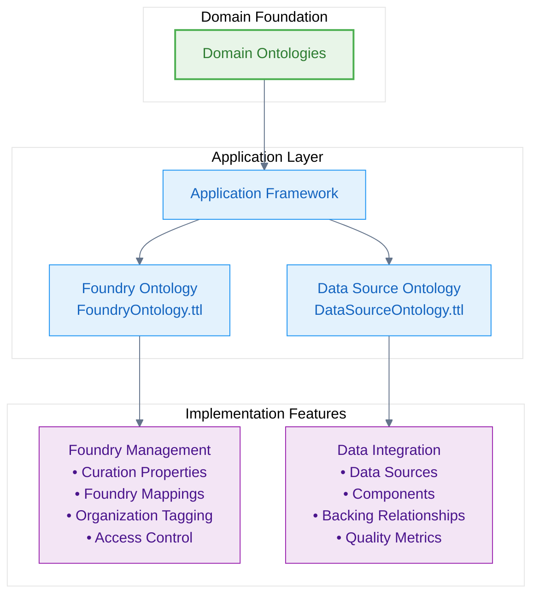
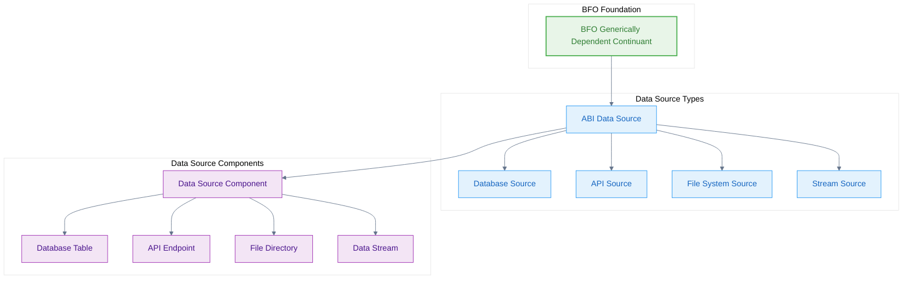

# Application Layer

The application layer of the Naas Ontology provides implementation-specific concepts that handle the practical aspects of deploying and managing ontological systems in production environments.

## Application Architecture

Application-level ontologies bridge domain concepts with specific implementation requirements:



## Foundry Ontology

The **FoundryOntology.ttl** provides the infrastructure for organizing and curating ontological concepts across different foundries (organizational contexts).

### Foundry Curation System

```turtle
@prefix abi: <http://ontology.naas.ai/abi/> .
@prefix bfo: <http://purl.obolibrary.org/obo/> .
@prefix cco: <https://www.commoncoreontologies.org/> .
@prefix xsd: <http://www.w3.org/2001/XMLSchema#> .

# Core foundry curation property
abi:is_curated_in_foundry a owl:DatatypeProperty ;
    rdfs:label "is curated in foundry"@en ;
    skos:definition "Relates a class to the foundry it is curated in."@en ;
    skos:example "The class cco:ont00001262 is curated in the foundry 'enterprise_management_foundry' and 'personal_ai_foundry'."@en ;
    rdfs:domain bfo:BFO_0000001 ; # Entity
    rdfs:range xsd:string .
```

### Foundry Categories

The system defines several foundry categories for different organizational contexts:

```turtle
# Enterprise management foundry
"enterprise_management_foundry" a abi:FoundryCategory ;
    rdfs:label "Enterprise Management Foundry"@en ;
    skos:definition "A foundry category for concepts related to enterprise management and operations."@en .

# Personal AI foundry  
"personal_ai_foundry" a abi:FoundryCategory ;
    rdfs:label "Personal AI Foundry"@en ;
    skos:definition "A foundry category for concepts related to personal AI assistance and productivity."@en .

# AI development foundry
"ai_development_foundry" a abi:FoundryCategory ;
    rdfs:label "AI Development Foundry"@en ;
    skos:definition "A foundry category for concepts related to AI system development and research."@en .

# Knowledge management foundry
"knowledge_management_foundry" a abi:FoundryCategory ;
    rdfs:label "Knowledge Management Foundry"@en ;
    skos:definition "A foundry category for concepts related to knowledge organization and semantic systems."@en .
```

### Systematic Foundry Mappings

The foundry ontology provides systematic mappings of CCO concepts to appropriate foundries:

```turtle
# Organization concepts
cco:ont00001180 abi:is_curated_in_foundry "enterprise_management_foundry", "personal_ai_foundry" .
cco:ont00000443 abi:is_curated_in_foundry "enterprise_management_foundry", "personal_ai_foundry" .
cco:ont00001302 abi:is_curated_in_foundry "enterprise_management_foundry", "personal_ai_foundry" .
cco:ont00000564 abi:is_curated_in_foundry "enterprise_management_foundry", "personal_ai_foundry" .
cco:ont00000408 abi:is_curated_in_foundry "enterprise_management_foundry", "personal_ai_foundry" .

# Person and role concepts
cco:ont00000419 abi:is_curated_in_foundry "enterprise_management_foundry", "personal_ai_foundry" .
cco:ont00000262 abi:is_curated_in_foundry "enterprise_management_foundry", "personal_ai_foundry" .

# AI-specific concepts
abi:AIAgent abi:is_curated_in_foundry "ai_development_foundry", "personal_ai_foundry" .
abi:AISystem abi:is_curated_in_foundry "ai_development_foundry", "enterprise_management_foundry" .
abi:CognitiveCapability abi:is_curated_in_foundry "ai_development_foundry", "knowledge_management_foundry" .
```

### Foundry Access Control

```turtle
# Foundry access control concepts
abi:FoundryAccess a owl:Class ;
    rdfs:subClassOf bfo:BFO_0000017 ; # Realizable Entity
    rdfs:label "Foundry Access"@en ;
    skos:definition "A realizable entity that represents access permissions to a specific foundry."@en .

abi:hasFoundryAccess a owl:ObjectProperty ;
    rdfs:label "has foundry access"@en ;
    rdfs:domain abi:Person ;
    rdfs:range abi:FoundryAccess ;
    skos:definition "Relates a person to their foundry access permissions."@en .

# Access levels
abi:ReadOnlyAccess a owl:Class ;
    rdfs:subClassOf abi:FoundryAccess ;
    rdfs:label "Read Only Access"@en .

abi:CuratorAccess a owl:Class ;
    rdfs:subClassOf abi:FoundryAccess ;
    rdfs:label "Curator Access"@en .

abi:AdminAccess a owl:Class ;
    rdfs:subClassOf abi:FoundryAccess ;
    rdfs:label "Admin Access"@en .
```

## Data Source Ontology

The **DataSourceOntology.ttl** provides concepts for managing data sources and their relationships to ontological entities.

### Data Source Hierarchy



```turtle
# Core data source concepts
abi:DataSource a owl:Class ;
    rdfs:subClassOf bfo:BFO_0000031 ; # Generically Dependent Continuant
    rdfs:label "Data Source"@en ;
    skos:definition "A Data Source is an entity that provides access to data or information. It represents the origin or provider of data that can be consumed by other systems or processes."@en ;
    skos:example "A database, API endpoint, file system, or web service that provides data."@en .

abi:DataSourceComponent a owl:Class ;
    rdfs:subClassOf abi:DataSource ;
    rdfs:label "Data Source Component"@en ;
    skos:definition "A Data Source Component is a constituent part of a larger data source system. It represents a modular piece that contributes to the overall functionality of the data source."@en ;
    skos:example "A specific table in a database, a particular endpoint in an API, or a specific file in a file system."@en .
```

### Data Source Relationships

```turtle
# Structural relationships
abi:hasComponent a owl:ObjectProperty ;
    rdfs:subPropertyOf bfo:BFO_0000115 ; # has part
    rdfs:label "has component"@en ;
    rdfs:domain abi:DataSource ;
    rdfs:range abi:DataSourceComponent ;
    skos:definition "Relates a data source to one of its constituent components. This property indicates that the data source includes or contains the specified component as part of its structure."@en ;
    owl:inverseOf abi:isComponentOf .

abi:isComponentOf a owl:ObjectProperty ;
    rdfs:subPropertyOf bfo:BFO_0000050 ; # part of
    rdfs:label "is component of"@en ;
    rdfs:domain abi:DataSourceComponent ;
    rdfs:range abi:DataSource ;
    skos:definition "Relates a data source component to the larger data source system it belongs to."@en .

# Backing relationships
abi:hasBackingDataSource a owl:ObjectProperty ;
    rdfs:label "has backing data source"@en ;
    rdfs:domain bfo:BFO_0000001 ; # Entity
    rdfs:range abi:DataSource ;
    skos:definition "Relates an entity to the data source that provides the underlying data for that entity. This property indicates the origin or source of the data that supports the entity."@en ;
    skos:example "A report entity may have a backing data source that provides the raw data used to generate the report."@en .
```

### Specific Data Source Types

```turtle
# Database sources
abi:DatabaseSource a owl:Class ;
    rdfs:subClassOf abi:DataSource ;
    rdfs:label "Database Source"@en ;
    skos:definition "A data source that provides access to structured data stored in a database system."@en .

abi:DatabaseTable a owl:Class ;
    rdfs:subClassOf abi:DataSourceComponent ;
    rdfs:label "Database Table"@en ;
    skos:definition "A data source component that represents a table within a database."@en .

# API sources
abi:APISource a owl:Class ;
    rdfs:subClassOf abi:DataSource ;
    rdfs:label "API Source"@en ;
    skos:definition "A data source that provides access to data through an Application Programming Interface."@en .

abi:APIEndpointComponent a owl:Class ;
    rdfs:subClassOf abi:DataSourceComponent ;
    rdfs:label "API Endpoint Component"@en ;
    skos:definition "A data source component that represents a specific endpoint within an API."@en .

# File system sources
abi:FileSystemSource a owl:Class ;
    rdfs:subClassOf abi:DataSource ;
    rdfs:label "File System Source"@en ;
    skos:definition "A data source that provides access to data stored in files within a file system."@en .

abi:FileDirectory a owl:Class ;
    rdfs:subClassOf abi:DataSourceComponent ;
    rdfs:label "File Directory"@en ;
    skos:definition "A data source component that represents a directory containing data files."@en .
```

### Data Quality and Metadata

```turtle
# Data quality concepts
abi:DataQuality a owl:Class ;
    rdfs:subClassOf bfo:BFO_0000019 ; # Quality
    rdfs:label "Data Quality"@en ;
    skos:definition "A quality that characterizes the reliability, accuracy, and completeness of data from a data source."@en .

abi:DataFreshness a owl:Class ;
    rdfs:subClassOf abi:DataQuality ;
    rdfs:label "Data Freshness"@en ;
    skos:definition "A data quality that measures how recently the data was updated or refreshed."@en .

abi:DataAccuracy a owl:Class ;
    rdfs:subClassOf abi:DataQuality ;
    rdfs:label "Data Accuracy"@en ;
    skos:definition "A data quality that measures how correctly the data represents the real-world entities it describes."@en .

# Metadata properties
abi:hasDataSchema a owl:ObjectProperty ;
    rdfs:label "has data schema"@en ;
    rdfs:domain abi:DataSource ;
    rdfs:range abi:DataSchema ;
    skos:definition "Relates a data source to its schema definition."@en .

abi:DataSchema a owl:Class ;
    rdfs:subClassOf bfo:BFO_0000031 ; # Generically Dependent Continuant
    rdfs:label "Data Schema"@en ;
    skos:definition "An information entity that defines the structure and format of data in a data source."@en .
```

## Application Integration Patterns

### Complete Integration Example

Here's how application-level concepts integrate with the full ontological stack:

```turtle
# Enterprise scenario with foundry organization
abi:acme_corp a abi:AIServiceProvider ;
    rdfs:label "Acme Corporation"@en ;
    abi:is_curated_in_foundry "enterprise_management_foundry" ;
    abi:operates abi:acme_ai_system .

# AI system with data backing
abi:acme_ai_system a abi:AISystem ;
    rdfs:label "Acme AI System"@en ;
    abi:hasBackingDataSource abi:acme_customer_db ;
    abi:is_curated_in_foundry "enterprise_management_foundry", "ai_development_foundry" .

# Data source with quality metrics
abi:acme_customer_db a abi:DatabaseSource ;
    rdfs:label "Acme Customer Database"@en ;
    abi:hasComponent abi:customer_table, abi:orders_table ;
    bfo:BFO_0000086 abi:high_data_quality . # has quality

abi:customer_table a abi:DatabaseTable ;
    rdfs:label "Customer Table"@en ;
    abi:hasDataSchema abi:customer_schema .

# Data quality assessment
abi:high_data_quality a abi:DataQuality ;
    rdfs:label "High Data Quality"@en ;
    abi:hasAccuracyScore "0.95"^^xsd:decimal ;
    abi:hasFreshnessScore "0.90"^^xsd:decimal .

# Foundry access control
abi:john_smith a abi:Person ;
    rdfs:label "John Smith"@en ;
    abi:hasFoundryAccess abi:enterprise_curator_access .

abi:enterprise_curator_access a abi:CuratorAccess ;
    rdfs:label "Enterprise Curator Access"@en ;
    abi:grantsAccessToFoundry "enterprise_management_foundry" .
```

### Deployment Configuration

Application-level ontologies also handle deployment-specific configurations:

```turtle
# Deployment environment concepts
abi:DeploymentEnvironment a owl:Class ;
    rdfs:subClassOf bfo:BFO_0000040 ; # Material Entity
    rdfs:label "Deployment Environment"@en ;
    skos:definition "A material entity that represents the infrastructure environment where AI systems are deployed."@en .

abi:ProductionEnvironment a owl:Class ;
    rdfs:subClassOf abi:DeploymentEnvironment ;
    rdfs:label "Production Environment"@en .

abi:StagingEnvironment a owl:Class ;
    rdfs:subClassOf abi:DeploymentEnvironment ;
    rdfs:label "Staging Environment"@en .

abi:DevelopmentEnvironment a owl:Class ;
    rdfs:subClassOf abi:DeploymentEnvironment ;
    rdfs:label "Development Environment"@en .

# Configuration management
abi:hasDeploymentConfig a owl:ObjectProperty ;
    rdfs:label "has deployment config"@en ;
    rdfs:domain abi:AISystem ;
    rdfs:range abi:DeploymentConfiguration .

abi:DeploymentConfiguration a owl:Class ;
    rdfs:subClassOf bfo:BFO_0000031 ; # Generically Dependent Continuant
    rdfs:label "Deployment Configuration"@en ;
    skos:definition "An information entity that specifies how an AI system should be deployed and configured."@en .
```

## Implementation in ABI

The application layer concepts are operationalized through ABI's infrastructure:

### Foundry Management
- **Curation workflows** - Systematic assignment of concepts to foundries
- **Access control** - Role-based permissions for foundry access
- **Organization mapping** - Alignment of foundries with organizational structure

### Data Source Integration
- **Automatic discovery** - Detection and cataloging of data sources
- **Quality monitoring** - Continuous assessment of data quality metrics
- **Schema evolution** - Management of data schema changes over time

## Next Steps

The application layer provides the foundation for:

1. **[Process-Centric Routing](/ontology-essentials/process-routing)** - AI routing based on application context
2. **Production deployment** - Real-world implementation of ontological systems
3. **Organizational integration** - Alignment with business processes and governance

---

*The application layer bridges ontological concepts with practical implementation requirements, enabling the deployment of semantic systems in production environments.*
