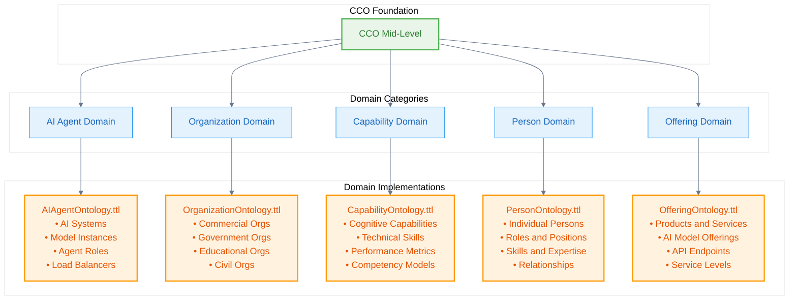
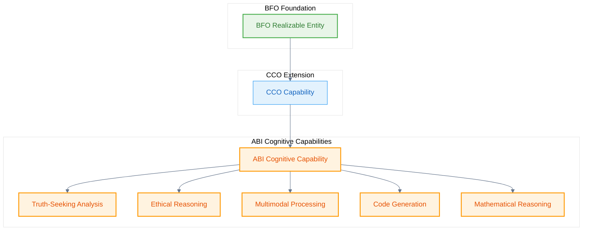

# Domain Ontologies

Domain ontologies in the Naas framework provide specialized concepts for specific domains, building systematically on BFO and CCO foundations. Each domain ontology addresses particular aspects of AI-powered knowledge management.

## Domain Architecture

The Naas Ontology includes several key domain ontologies:



## AI Agent Domain Ontology

The **AIAgentOntology.ttl** provides comprehensive modeling of AI systems and their components:

### Core AI System Classes

```turtle
@prefix abi: <http://ontology.naas.ai/abi/> .
@prefix bfo: <http://purl.obolibrary.org/obo/> .
@prefix cco: <https://www.commoncoreontologies.org/> .

# AI System hierarchy
abi:AISystem a owl:Class ;
    rdfs:subClassOf bfo:BFO_0000040 ; # Material Entity
    rdfs:label "AI System"@en ;
    skos:definition "A material entity that implements artificial intelligence capabilities."@en ;
    skos:example "ChatGPT server infrastructure, Claude API endpoints, Gemini model instances."@en .

abi:AIModelInstance a owl:Class ;
    rdfs:subClassOf bfo:BFO_0000040 ; # Material Entity
    rdfs:label "AI Model Instance"@en ;
    skos:definition "A material entity that is a specific instantiation of an AI model running on hardware."@en ;
    skos:example "GPT-4 model running on OpenAI's servers, Claude-3-Sonnet instance."@en .

abi:AIAgent a owl:Class ;
    rdfs:subClassOf cco:ont00001017 ; # Agent
    rdfs:label "AI Agent"@en ;
    skos:definition "An agent that is an artificial intelligence system capable of autonomous decision-making and task execution."@en ;
    skos:example "ChatGPT, Claude, Gemini, and other AI systems that can engage in conversations and perform various tasks."@en .
```

### Agent Roles and Capabilities

```turtle
# Realizable entities for AI agent roles
abi:AgentRole a owl:Class ;
    rdfs:subClassOf bfo:BFO_0000017 ; # Realizable Entity
    rdfs:label "Agent Role"@en ;
    skos:definition "A realizable entity that defines the specialized function or role of an AI agent within a system."@en ;
    skos:example "Primary responder, fallback handler, specialized task executor, coordinator, validator."@en .

# Specific agent roles
abi:PrimaryResponderRole a owl:Class ;
    rdfs:subClassOf abi:AgentRole ;
    rdfs:label "Primary Responder Role"@en ;
    skos:definition "The role of being the first agent to handle incoming requests."@en .

abi:FallbackHandlerRole a owl:Class ;
    rdfs:subClassOf abi:AgentRole ;
    rdfs:label "Fallback Handler Role"@en ;
    skos:definition "The role of handling requests when primary agents are unavailable or fail."@en .

abi:SpecializedTaskExecutorRole a owl:Class ;
    rdfs:subClassOf abi:AgentRole ;
    rdfs:label "Specialized Task Executor Role"@en ;
    skos:definition "The role of executing specific types of tasks that require specialized capabilities."@en .
```

### Infrastructure Components

```turtle
# System infrastructure
abi:LoadBalancer a owl:Class ;
    rdfs:subClassOf bfo:BFO_0000040 ; # Material Entity
    rdfs:label "Load Balancer"@en ;
    skos:definition "A material entity that distributes incoming requests across multiple AI agents to optimize performance and availability."@en .

abi:APIEndpoint a owl:Class ;
    rdfs:subClassOf bfo:BFO_0000040 ; # Material Entity
    rdfs:label "API Endpoint"@en ;
    skos:definition "A material entity that provides a specific interface for accessing AI system functionality."@en .

abi:ModelRegistry a owl:Class ;
    rdfs:subClassOf bfo:BFO_0000040 ; # Material Entity
    rdfs:label "Model Registry"@en ;
    skos:definition "A material entity that maintains information about available AI models and their capabilities."@en .
```

## Organization Domain Ontology

The **OrganizationOntology.ttl** extends CCO organization concepts for AI contexts:

```turtle
# AI-focused organization types
abi:AIResearchOrganization a owl:Class ;
    rdfs:subClassOf cco:ont00001180 ; # Organization
    rdfs:label "AI Research Organization"@en ;
    skos:definition "An organization primarily focused on artificial intelligence research and development."@en ;
    skos:example "OpenAI, Anthropic, Google DeepMind, Mistral AI."@en .

abi:AIServiceProvider a owl:Class ;
    rdfs:subClassOf cco:ont00000443 ; # Commercial Organization
    rdfs:label "AI Service Provider"@en ;
    skos:definition "A commercial organization that provides AI services to other organizations or individuals."@en .

# Organizational relationships
abi:develops a owl:ObjectProperty ;
    rdfs:label "develops"@en ;
    rdfs:domain abi:AIResearchOrganization ;
    rdfs:range abi:AIModelInstance ;
    skos:definition "Relates an AI research organization to the AI models it develops."@en .

abi:operates a owl:ObjectProperty ;
    rdfs:label "operates"@en ;
    rdfs:domain abi:AIServiceProvider ;
    rdfs:range abi:AISystem ;
    skos:definition "Relates an AI service provider to the AI systems it operates."@en .
```

## Capability Domain Ontology

The **CapabilityOntology.ttl** models cognitive and technical capabilities:



```turtle
# Cognitive capabilities
abi:CognitiveCapability a owl:Class ;
    rdfs:subClassOf bfo:BFO_0000017 ; # Realizable Entity
    rdfs:label "Cognitive Capability"@en ;
    skos:definition "A realizable entity that represents a cognitive ability of an AI system."@en .

# Specific cognitive capabilities
abi:TruthSeekingCapability a owl:Class ;
    rdfs:subClassOf abi:CognitiveCapability ;
    rdfs:label "Truth-Seeking Capability"@en ;
    skos:definition "The capability to analyze information with a focus on finding truth and identifying potential biases or errors."@en .

abi:EthicalReasoningCapability a owl:Class ;
    rdfs:subClassOf abi:CognitiveCapability ;
    rdfs:label "Ethical Reasoning Capability"@en ;
    skos:definition "The capability to analyze situations from ethical perspectives and provide morally-informed responses."@en .

abi:MultimodalProcessingCapability a owl:Class ;
    rdfs:subClassOf abi:CognitiveCapability ;
    rdfs:label "Multimodal Processing Capability"@en ;
    skos:definition "The capability to process and integrate information from multiple modalities (text, image, audio, video)."@en .

# Capability measurement
abi:CapabilityLevel a owl:Class ;
    rdfs:subClassOf bfo:BFO_0000019 ; # Quality
    rdfs:label "Capability Level"@en ;
    skos:definition "A quality that measures the proficiency level of a specific capability."@en .
```

## Person Domain Ontology

The **PersonOntology.ttl** models individuals and their relationships to AI systems:

```turtle
# Person as independent continuant
abi:Person a owl:Class ;
    rdfs:subClassOf bfo:BFO_0000004 ; # Independent Continuant
    rdfs:label "Person"@en ;
    skos:definition "An individual human being."@en .

# AI-related person roles
abi:AIResearcher a owl:Class ;
    rdfs:subClassOf bfo:BFO_0000017 ; # Realizable Entity (Role)
    rdfs:label "AI Researcher"@en ;
    skos:definition "A role of a person who conducts research in artificial intelligence."@en .

abi:AIEngineer a owl:Class ;
    rdfs:subClassOf bfo:BFO_0000017 ; # Realizable Entity (Role)
    rdfs:label "AI Engineer"@en ;
    skos:definition "A role of a person who develops and maintains AI systems."@en .

abi:OntologyEngineer a owl:Class ;
    rdfs:subClassOf bfo:BFO_0000017 ; # Realizable Entity (Role)
    rdfs:label "Ontology Engineer"@en ;
    skos:definition "A role of a person who designs and develops ontological structures."@en .

# Person-AI relationships
abi:interactsWith a owl:ObjectProperty ;
    rdfs:label "interacts with"@en ;
    rdfs:domain abi:Person ;
    rdfs:range abi:AIAgent ;
    skos:definition "Relates a person to an AI agent they interact with."@en .
```

## Offering Domain Ontology

The **OfferingOntology.ttl** models products and services in the AI domain:

```turtle
# AI offerings
abi:AIOffering a owl:Class ;
    rdfs:subClassOf bfo:BFO_0000031 ; # Generically Dependent Continuant
    rdfs:label "AI Offering"@en ;
    skos:definition "A generically dependent continuant that represents an AI-related product or service offering."@en .

abi:AIModelOffering a owl:Class ;
    rdfs:subClassOf abi:AIOffering ;
    rdfs:label "AI Model Offering"@en ;
    skos:definition "An AI offering that provides access to a specific AI model."@en ;
    skos:example "GPT-4 API access, Claude Pro subscription, Gemini Advanced."@en .

abi:OntologyService a owl:Class ;
    rdfs:subClassOf abi:AIOffering ;
    rdfs:label "Ontology Service"@en ;
    skos:definition "An AI offering that provides ontology-related services."@en ;
    skos:example "Ontology engineering consultation, knowledge graph construction, semantic data integration."@en .

# Service level agreements
abi:ServiceLevel a owl:Class ;
    rdfs:subClassOf bfo:BFO_0000019 ; # Quality
    rdfs:label "Service Level"@en ;
    skos:definition "A quality that characterizes the level of service provided by an AI offering."@en .
```

## Cross-Domain Integration Example

Here's how multiple domain ontologies work together:

```turtle
# Complete scenario: AI research organization with capabilities
abi:anthropic a abi:AIResearchOrganization ;
    rdfs:label "Anthropic"@en ;
    abi:develops abi:claude_3_sonnet ;
    abi:employs abi:dario_amodei .

abi:claude_3_sonnet a abi:AIModelInstance ;
    rdfs:label "Claude 3 Sonnet"@en ;
    bfo:BFO_0000087 abi:ethical_reasoning_role ; # has role
    abi:hasCapability abi:ethical_reasoning_capability .

abi:ethical_reasoning_capability a abi:EthicalReasoningCapability ;
    rdfs:label "Ethical Reasoning Capability"@en ;
    bfo:BFO_0000086 abi:high_capability_level . # has quality

abi:dario_amodei a abi:Person ;
    rdfs:label "Dario Amodei"@en ;
    bfo:BFO_0000087 abi:ai_researcher_role ; # has role
    abi:interactsWith abi:claude_3_sonnet .

abi:claude_pro_offering a abi:AIModelOffering ;
    rdfs:label "Claude Pro Offering"@en ;
    abi:providesAccessTo abi:claude_3_sonnet ;
    bfo:BFO_0000086 abi:premium_service_level . # has quality
```

## Domain Ontology Patterns

All domain ontologies follow consistent patterns:

### 1. BFO Grounding
Every concept is properly grounded in BFO categories:
- **Material entities** for physical/digital systems
- **Processes** for activities and workflows
- **Qualities** for measurable properties
- **Realizable entities** for roles and capabilities
- **Information entities** for data and knowledge structures

### 2. CCO Extension
Domain concepts extend appropriate CCO mid-level concepts rather than directly extending BFO.

### 3. Systematic Relationships
Domain ontologies define systematic relationships between concepts using both BFO relations and domain-specific properties.

### 4. Foundry Integration
All domain concepts can be tagged with foundry curation information for organizational management.

## Next Steps

Domain ontologies provide the specialized foundation for:

1. **[Application Layer](/ontology-essentials/application-layer)** - Implementation-specific concepts
2. **[Process-Centric Routing](/ontology-essentials/process-routing)** - AI routing based on domain capabilities

---

*Domain ontologies provide the specialized concepts needed for AI-powered knowledge management while maintaining systematic grounding in BFO and CCO foundations.*
