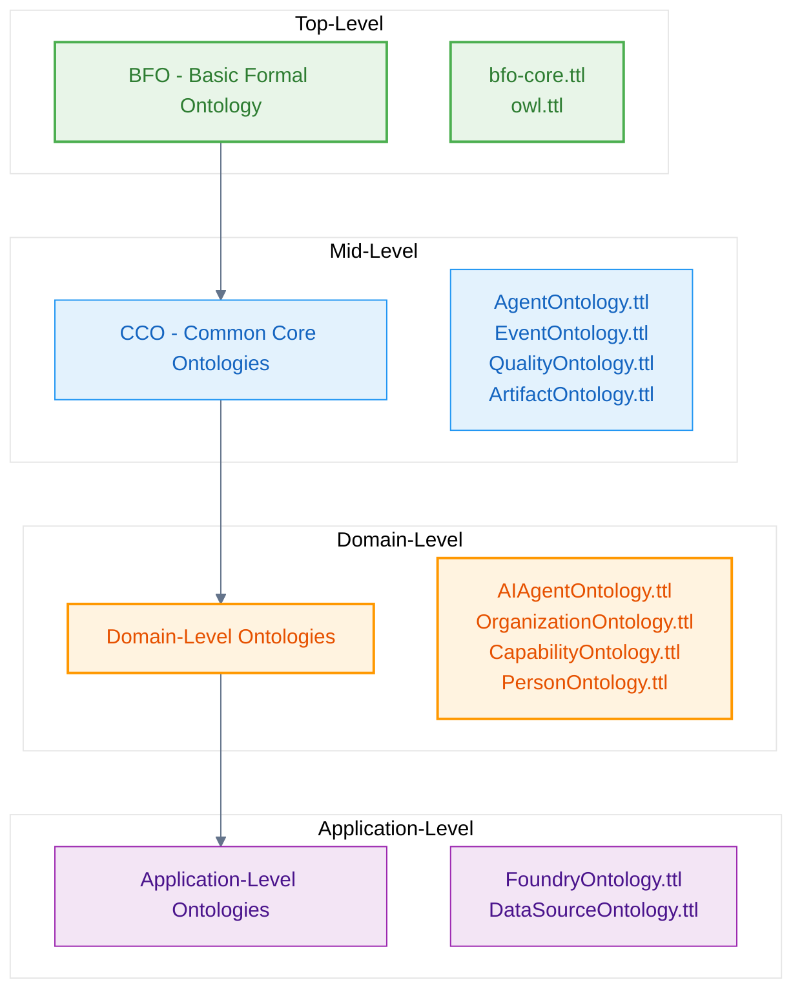
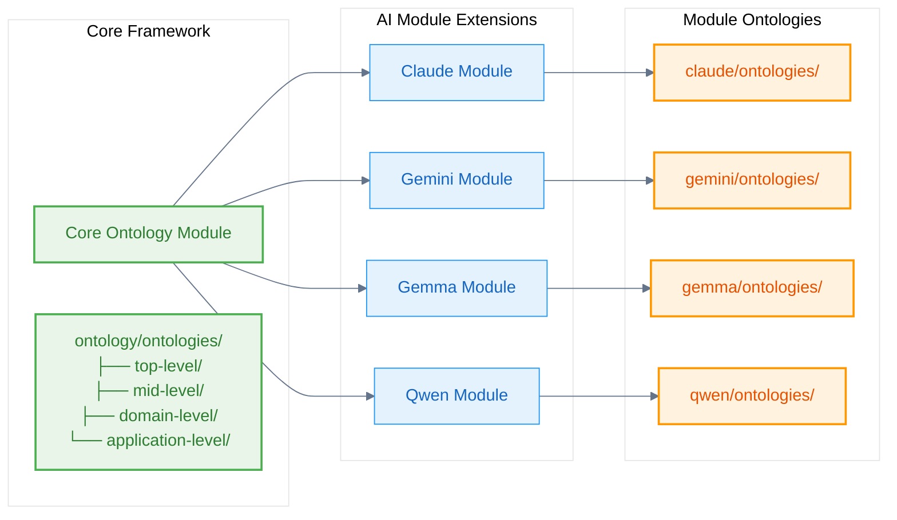

# Introduction

The **Naas Ontology** is a comprehensive semantic framework that systematically incorporates **Basic Formal Ontology (BFO)** and **Common Core Ontologies (CCO)**, extending them through domain-specific and application-level ontologies for AI-powered knowledge management.

## Ontological Architecture

The Naas Ontology follows a principled 4-level hierarchy based on ontological abstraction:



## Core Principles

### 1. BFO Foundation
All concepts are grounded in Basic Formal Ontology's systematic categorization:

```turtle
@prefix bfo: <http://purl.obolibrary.org/obo/> .
@prefix abi: <http://ontology.naas.ai/abi/> .

# Everything starts with BFO Entity
bfo:BFO_0000001 a owl:Class ;
    rdfs:label "Entity"@en ;
    skos:definition "An entity is anything that exists or has existed or will exist"@en .
```

### 2. Systematic Extension
Each level builds systematically on the previous, maintaining ontological rigor:

- **BFO** provides the foundational categories
- **CCO** adds common-sense concepts
- **Domain** ontologies specify particular domains
- **Application** ontologies handle implementation details

### 3. Process-Centric AI Routing
The ontology enables intelligent routing based on BFO's process categorization rather than specific AI models.

## Modular AI Integration

Each AI module in the ABI system extends the core ontological framework:



## Implementation in ABI

The Naas Ontology is operationalized through the **Agentic Brain Infrastructure (ABI)**:

### Ontology Engineering Agents
- **OntologyEngineerAgent** - BFO expert for ontology development
- **EntitytoSPARQLAgent** - Extract entities and generate SPARQL
- **KnowledgeGraphBuilderAgent** - Manage knowledge graphs

### Processing Infrastructure
- **Pipelines** - SPARQL operations, workflow management
- **Workflows** - Complex multi-step processes
- **Validation** - Ensure BFO compliance and consistency

## Next Steps

Explore each level of the ontological hierarchy:

1. **[Top-Level](/ontology-essentials/top-level)** - Understanding the 7 Buckets framework
2. **[Mid-Level](/ontology-essentials/mid-level)** - Common Core Ontologies integration
3. **[Domain-Level](/ontology-essentials/domain-level)** - AI Agent, Organization, and other domains
4. **[Application-Level](/ontology-essentials/application-level)** - Foundry integration and data sources
5. **[Process-Centric Routing](/ontology-essentials/process-routing)** - AI routing based on cognitive processes

---

*The Naas Ontology provides a principled foundation for AI-powered knowledge management, systematically building from formal ontological principles to practical implementation.*
