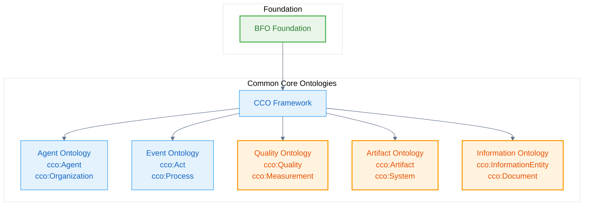
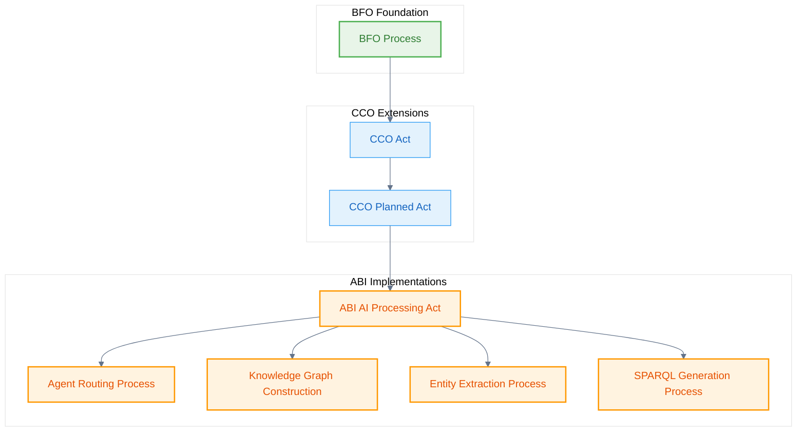
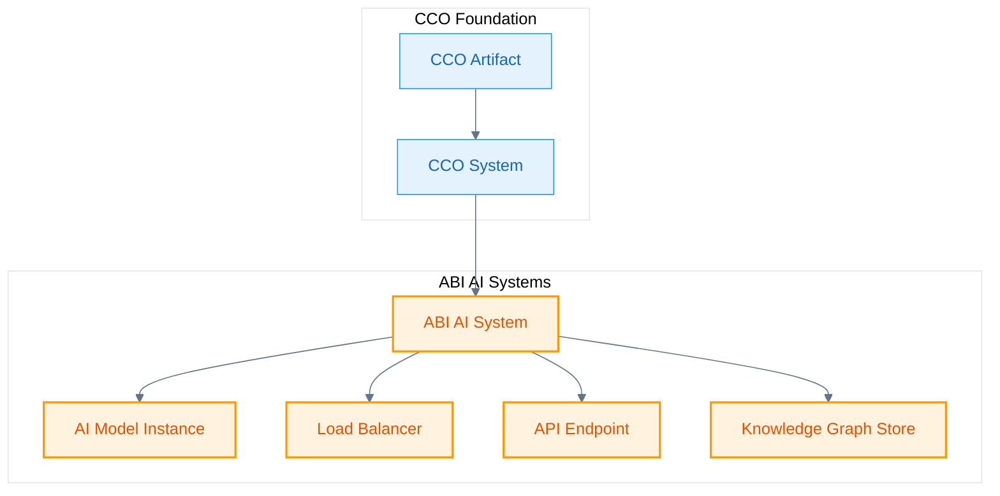

# Mid-Level

The **Common Core Ontologies (CCO)** extend BFO with mid-level concepts that are common across many domains. The Naas Ontology incorporates CCO and extends it with AI-specific concepts.

## CCO Architecture

CCO provides a systematic extension of BFO with practical, reusable concepts:



## Agent Ontology Extension

CCO's Agent concepts are extended for AI systems in the Naas Ontology:

```turtle
@prefix cco: <https://www.commoncoreontologies.org/> .
@prefix abi: <http://ontology.naas.ai/abi/> .
@prefix bfo: <http://purl.obolibrary.org/obo/> .

# CCO Agent as foundation
cco:ont00001017 a owl:Class ;
    rdfs:subClassOf bfo:BFO_0000004 ; # Independent Continuant
    rdfs:label "Agent"@en ;
    skos:definition "An independent continuant that is capable of performing actions"@en .

# Naas extension: AI Agent
abi:AIAgent a owl:Class ;
    rdfs:subClassOf cco:ont00001017 ; # Agent
    rdfs:label "AI Agent"@en ;
    skos:definition "An agent that is an artificial intelligence system capable of autonomous decision-making and task execution."@en ;
    skos:example "ChatGPT, Claude, Gemini, and other AI systems that can engage in conversations and perform various tasks."@en .

# Specific AI agent instances
abi:ClaudeAgent a owl:Class ;
    rdfs:subClassOf abi:AIAgent ;
    rdfs:label "Claude Agent"@en ;
    skos:definition "An AI agent based on Anthropic's Claude model family."@en .

abi:GeminiAgent a owl:Class ;
    rdfs:subClassOf abi:AIAgent ;
    rdfs:label "Gemini Agent"@en ;
    skos:definition "An AI agent based on Google's Gemini model family."@en .
```

## Organization Ontology

CCO's organization concepts are specialized for AI system organization:

```turtle
# CCO Organization foundation
cco:ont00001180 a owl:Class ;
    rdfs:subClassOf cco:ont00001017 ; # Agent
    rdfs:label "Organization"@en ;
    skos:definition "An agent that is a social entity with a collective goal"@en .

# AI System Organization
abi:AISystemOrganization a owl:Class ;
    rdfs:subClassOf cco:ont00001180 ; # Organization
    rdfs:label "AI System Organization"@en ;
    skos:definition "An organization that develops, maintains, or operates AI systems."@en ;
    skos:example "OpenAI, Anthropic, Google DeepMind, Mistral AI."@en .

# Foundry Organization
abi:FoundryOrganization a owl:Class ;
    rdfs:subClassOf cco:ont00001180 ; # Organization
    rdfs:label "Foundry Organization"@en ;
    skos:definition "An organization that curates and manages ontological foundries."@en .
```

## Process and Event Extensions

CCO's process concepts are extended for AI-specific processes:



```turtle
# CCO Act foundation
cco:ont00000006 a owl:Class ;
    rdfs:subClassOf bfo:BFO_0000015 ; # Process
    rdfs:label "Act"@en ;
    skos:definition "A process that is intentionally performed by an agent"@en .

# AI-specific acts
abi:AIProcessingAct a owl:Class ;
    rdfs:subClassOf cco:ont00000006 ; # Act
    rdfs:label "AI Processing Act"@en ;
    skos:definition "An act performed by an AI agent to process information and generate responses."@en .

abi:OntologyEngineeringAct a owl:Class ;
    rdfs:subClassOf abi:AIProcessingAct ;
    rdfs:label "Ontology Engineering Act"@en ;
    skos:definition "An act of creating, modifying, or analyzing ontological structures."@en .

abi:EntityExtractionAct a owl:Class ;
    rdfs:subClassOf abi:AIProcessingAct ;
    rdfs:label "Entity Extraction Act"@en ;
    skos:definition "An act of identifying and extracting entities from unstructured text."@en .
```

## Quality and Measurement Extensions

CCO's quality concepts are specialized for AI system measurements:

```turtle
# CCO Quality foundation
cco:ont00001018 a owl:Class ;
    rdfs:subClassOf bfo:BFO_0000019 ; # Quality
    rdfs:label "Quality"@en ;
    skos:definition "A specifically dependent continuant that is exhibited if it is the bearer of some quality"@en .

# AI Performance Qualities
abi:AIPerformanceQuality a owl:Class ;
    rdfs:subClassOf cco:ont00001018 ; # Quality
    rdfs:label "AI Performance Quality"@en ;
    skos:definition "A quality that characterizes the performance of an AI system."@en .

abi:IntelligenceScore a owl:Class ;
    rdfs:subClassOf abi:AIPerformanceQuality ;
    rdfs:label "Intelligence Score"@en ;
    skos:definition "A quality that measures the cognitive capability of an AI system."@en .

abi:TokenProcessingSpeed a owl:Class ;
    rdfs:subClassOf abi:AIPerformanceQuality ;
    rdfs:label "Token Processing Speed"@en ;
    skos:definition "A quality that measures how many tokens per second an AI system can process."@en .

# Measurement Units
abi:TokensPerSecond a owl:Class ;
    rdfs:subClassOf cco:ont00001019 ; # Measurement Unit
    rdfs:label "Tokens Per Second"@en ;
    skos:definition "A measurement unit for AI system processing speed."@en .
```

## Information Entity Extensions

CCO's information concepts are extended for AI-specific information structures:

```turtle
# CCO Information Entity foundation
cco:ont00001020 a owl:Class ;
    rdfs:subClassOf bfo:BFO_0000031 ; # Generically Dependent Continuant
    rdfs:label "Information Content Entity"@en ;
    skos:definition "A generically dependent continuant that is about some entity"@en .

# AI-specific information entities
abi:OntologyDefinition a owl:Class ;
    rdfs:subClassOf cco:ont00001020 ; # Information Content Entity
    rdfs:label "Ontology Definition"@en ;
    skos:definition "An information content entity that specifies the structure and meaning of an ontology."@en .

abi:SPARQLQuery a owl:Class ;
    rdfs:subClassOf cco:ont00001020 ; # Information Content Entity
    rdfs:label "SPARQL Query"@en ;
    skos:definition "An information content entity that represents a query in SPARQL language."@en .

abi:PromptTemplate a owl:Class ;
    rdfs:subClassOf cco:ont00001020 ; # Information Content Entity
    rdfs:label "Prompt Template"@en ;
    skos:definition "An information content entity that provides a template for AI agent prompts."@en .
```

## Artifact and System Extensions

CCO's artifact concepts are extended for AI systems and infrastructure:



```turtle
# CCO System foundation
cco:ont00001021 a owl:Class ;
    rdfs:subClassOf bfo:BFO_0000040 ; # Material Entity
    rdfs:label "System"@en ;
    skos:definition "A material entity that consists of multiple components organized to achieve a specific function"@en .

# AI System specialization
abi:AISystem a owl:Class ;
    rdfs:subClassOf cco:ont00001021 ; # System
    rdfs:label "AI System"@en ;
    skos:definition "A system that implements artificial intelligence capabilities."@en .

abi:LoadBalancer a owl:Class ;
    rdfs:subClassOf abi:AISystem ;
    rdfs:label "Load Balancer"@en ;
    skos:definition "An AI system component that distributes requests across multiple AI agents."@en .

abi:KnowledgeGraphStore a owl:Class ;
    rdfs:subClassOf abi:AISystem ;
    rdfs:label "Knowledge Graph Store"@en ;
    skos:definition "An AI system component that stores and manages knowledge graphs."@en .
```

## Foundry Integration Pattern

The CCO extensions include a systematic pattern for foundry-based curation:

```turtle
# Foundry curation property
abi:is_curated_in_foundry a owl:DatatypeProperty ;
    rdfs:label "is curated in foundry"@en ;
    skos:definition "Relates a class to the foundry it is curated in."@en ;
    skos:example "The class cco:ont00001262 is curated in the foundry 'enterprise_management_foundry' and 'personal_ai_foundry'."@en ;
    rdfs:domain bfo:BFO_0000001 ; # Entity
    rdfs:range xsd:string .

# Example foundry mappings
cco:ont00001180 abi:is_curated_in_foundry "enterprise_management_foundry", "personal_ai_foundry" .
cco:ont00000443 abi:is_curated_in_foundry "enterprise_management_foundry", "personal_ai_foundry" .
cco:ont00001302 abi:is_curated_in_foundry "enterprise_management_foundry", "personal_ai_foundry" .
```

## Implementation Example

Here's a complete example showing CCO extension in action:

```turtle
# Organization with AI capabilities
abi:anthropic_org a abi:AISystemOrganization ;
    rdfs:label "Anthropic"@en ;
    cco:ont00001022 abi:claude_agent ; # has member
    abi:is_curated_in_foundry "ai_development_foundry" .

# AI Agent with CCO grounding
abi:claude_agent a abi:ClaudeAgent ;
    rdfs:label "Claude AI Agent"@en ;
    cco:ont00001023 abi:ethical_reasoning_capability ; # has capability
    bfo:BFO_0000086 abi:claude_intelligence_score . # has quality

# Capability as CCO realizable entity
abi:ethical_reasoning_capability a abi:CognitiveCapability ;
    rdfs:label "Ethical Reasoning Capability"@en ;
    skos:definition "The capability to perform ethical analysis and reasoning"@en .

# Quality measurement
abi:claude_intelligence_score a abi:IntelligenceScore ;
    rdfs:label "Claude Intelligence Score"@en ;
    abi:hasNumericValue "64"^^xsd:integer ;
    cco:ont00001024 abi:intelligence_measurement_unit . # has measurement unit
```

## Next Steps

The CCO extensions provide the mid-level foundation for:

1. **[Domain-Level](/ontology-essentials/domain-level)** - Specific domains that build on CCO concepts
2. **[Application-Level](/ontology-essentials/application-level)** - Implementation-specific extensions
3. **[Process-Centric Routing](/ontology-essentials/process-routing)** - AI routing based on CCO process analysis

---

*CCO extensions bridge the gap between BFO's abstract categories and domain-specific concepts, providing reusable mid-level ontological structures for AI systems.*
