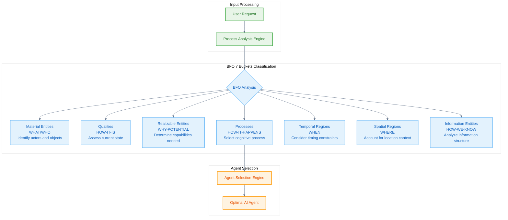
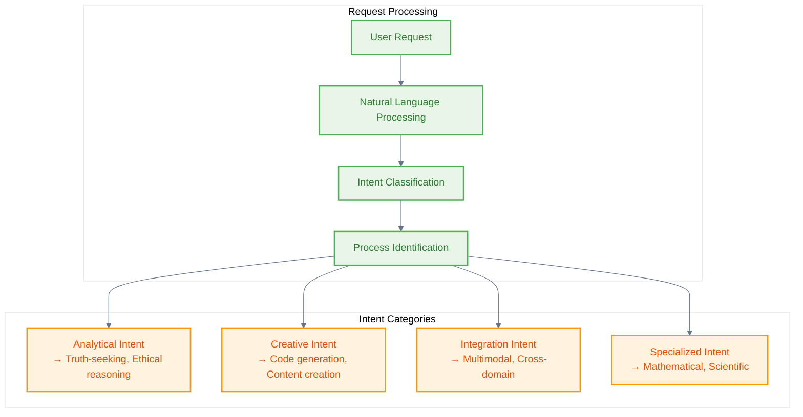
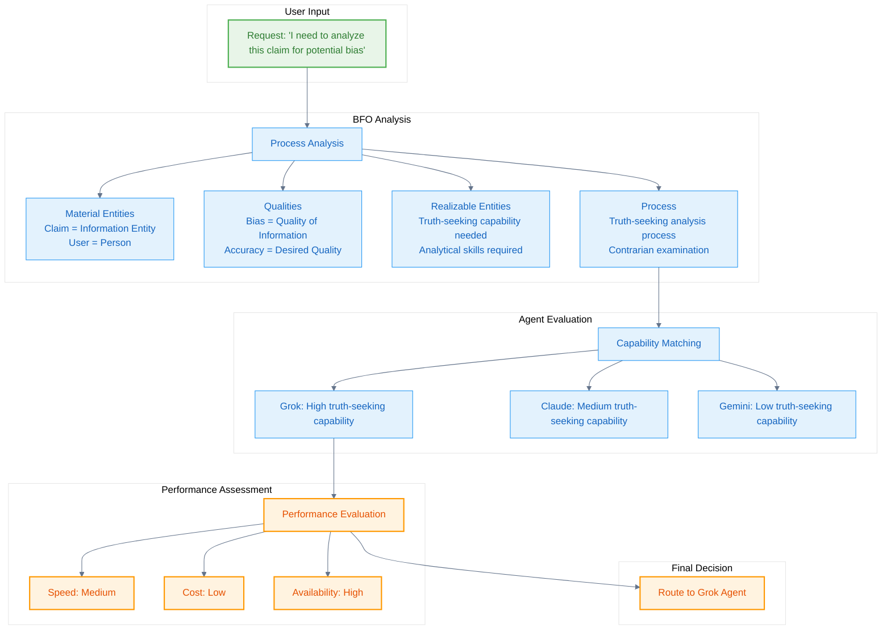

# Process-Centric Routing

Process-centric routing is the core innovation of the Naas Ontology system, enabling intelligent AI agent selection based on **cognitive processes** rather than specific AI models. This approach is grounded in BFO's systematic categorization of processes and realizable entities.

## Conceptual Foundation

Traditional AI routing focuses on **brand-based selection**:
- "I want to use Claude"
- "Switch to GPT-4"
- "Ask Gemini"

Process-centric routing focuses on **cognitive needs**:
- "I need ethical reasoning"
- "I need truth-seeking analysis"
- "I need multimodal processing"

## BFO Process Framework

The routing system is built on BFO's process ontology and the 7 Buckets framework:



## Cognitive Process Taxonomy

The Naas Ontology defines a systematic taxonomy of cognitive processes:

```turtle
@prefix abi: <http://ontology.naas.ai/abi/> .
@prefix bfo: <http://purl.obolibrary.org/obo/> .

# Core cognitive process types
abi:CognitiveProcess a owl:Class ;
    rdfs:subClassOf bfo:BFO_0000015 ; # Process
    rdfs:label "Cognitive Process"@en ;
    skos:definition "A process that involves mental activities such as reasoning, analysis, or decision-making."@en .

# Analytical processes
abi:AnalyticalProcess a owl:Class ;
    rdfs:subClassOf abi:CognitiveProcess ;
    rdfs:label "Analytical Process"@en ;
    skos:definition "A cognitive process focused on breaking down complex information into components for understanding."@en .

abi:TruthSeekingAnalysis a owl:Class ;
    rdfs:subClassOf abi:AnalyticalProcess ;
    rdfs:label "Truth-Seeking Analysis"@en ;
    skos:definition "An analytical process focused on identifying truth, detecting biases, and providing contrarian perspectives."@en .

abi:EthicalReasoning a owl:Class ;
    rdfs:subClassOf abi:AnalyticalProcess ;
    rdfs:label "Ethical Reasoning"@en ;
    skos:definition "An analytical process focused on moral and ethical considerations in decision-making."@en .

# Creative processes
abi:CreativeProcess a owl:Class ;
    rdfs:subClassOf abi:CognitiveProcess ;
    rdfs:label "Creative Process"@en ;
    skos:definition "A cognitive process focused on generating novel ideas, solutions, or content."@en .

abi:CodeGeneration a owl:Class ;
    rdfs:subClassOf abi:CreativeProcess ;
    rdfs:label "Code Generation"@en ;
    skos:definition "A creative process focused on generating computer code and programming solutions."@en .

abi:ContentCreation a owl:Class ;
    rdfs:subClassOf abi:CreativeProcess ;
    rdfs:label "Content Creation"@en ;
    skos:definition "A creative process focused on generating written, visual, or multimedia content."@en .

# Integration processes
abi:IntegrationProcess a owl:Class ;
    rdfs:subClassOf abi:CognitiveProcess ;
    rdfs:label "Integration Process"@en ;
    skos:definition "A cognitive process focused on combining multiple sources of information or modalities."@en .

abi:MultimodalProcessing a owl:Class ;
    rdfs:subClassOf abi:IntegrationProcess ;
    rdfs:label "Multimodal Processing"@en ;
    skos:definition "An integration process that combines information from multiple modalities (text, image, audio, video)."@en .
```

## Agent Capability Mapping

Each AI agent is characterized by its cognitive capabilities, grounded in BFO's realizable entity framework:

```turtle
# Agent capability profiles
abi:grok_agent a abi:AIAgent ;
    rdfs:label "Grok Agent"@en ;
    abi:hasCapability abi:truth_seeking_capability ;
    abi:hasPerformanceScore abi:grok_intelligence_score .

abi:truth_seeking_capability a abi:CognitiveCapability ;
    rdfs:subClassOf bfo:BFO_0000017 ; # Realizable Entity
    rdfs:label "Truth-Seeking Capability"@en ;
    abi:realizesProcess abi:TruthSeekingAnalysis ;
    abi:hasCapabilityLevel abi:high_level .

abi:claude_agent a abi:AIAgent ;
    rdfs:label "Claude Agent"@en ;
    abi:hasCapability abi:ethical_reasoning_capability ;
    abi:hasPerformanceScore abi:claude_intelligence_score .

abi:ethical_reasoning_capability a abi:CognitiveCapability ;
    rdfs:label "Ethical Reasoning Capability"@en ;
    abi:realizesProcess abi:EthicalReasoning ;
    abi:hasCapabilityLevel abi:high_level .

abi:gemini_agent a abi:AIAgent ;
    rdfs:label "Gemini Agent"@en ;
    abi:hasCapability abi:multimodal_capability ;
    abi:hasPerformanceScore abi:gemini_intelligence_score .

abi:multimodal_capability a abi:CognitiveCapability ;
    rdfs:label "Multimodal Processing Capability"@en ;
    abi:realizesProcess abi:MultimodalProcessing ;
    abi:hasCapabilityLevel abi:very_high_level .
```

## Routing Algorithm

The process-centric routing algorithm operates through systematic BFO-based analysis:

### 1. Request Analysis Phase



### 2. Capability Matching Phase

```turtle
# Routing rules based on process-capability matching
abi:RoutingRule a owl:Class ;
    rdfs:subClassOf bfo:BFO_0000031 ; # Generically Dependent Continuant
    rdfs:label "Routing Rule"@en ;
    skos:definition "An information entity that specifies how to route requests based on cognitive process requirements."@en .

# Specific routing rules
abi:truth_seeking_routing_rule a abi:RoutingRule ;
    rdfs:label "Truth-Seeking Routing Rule"@en ;
    abi:matchesProcess abi:TruthSeekingAnalysis ;
    abi:recommendsAgent abi:grok_agent ;
    abi:hasConfidenceScore "0.85"^^xsd:decimal .

abi:ethical_reasoning_routing_rule a abi:RoutingRule ;
    rdfs:label "Ethical Reasoning Routing Rule"@en ;
    abi:matchesProcess abi:EthicalReasoning ;
    abi:recommendsAgent abi:claude_agent ;
    abi:hasConfidenceScore "0.90"^^xsd:decimal .

abi:multimodal_routing_rule a abi:RoutingRule ;
    rdfs:label "Multimodal Routing Rule"@en ;
    abi:matchesProcess abi:MultimodalProcessing ;
    abi:recommendsAgent abi:gemini_agent ;
    abi:hasConfidenceScore "0.88"^^xsd:decimal .
```

### 3. Performance Optimization Phase

The routing system considers multiple factors for optimal selection:

```turtle
# Performance factors
abi:PerformanceFactor a owl:Class ;
    rdfs:subClassOf bfo:BFO_0000019 ; # Quality
    rdfs:label "Performance Factor"@en ;
    skos:definition "A quality that influences the performance of AI agent routing decisions."@en .

# Specific performance factors
abi:ResponseSpeed a owl:Class ;
    rdfs:subClassOf abi:PerformanceFactor ;
    rdfs:label "Response Speed"@en ;
    skos:definition "The speed at which an AI agent can process and respond to requests."@en .

abi:CostEfficiency a owl:Class ;
    rdfs:subClassOf abi:PerformanceFactor ;
    rdfs:label "Cost Efficiency"@en ;
    skos:definition "The cost-effectiveness of using a particular AI agent for a given task."@en .

abi:Availability a owl:Class ;
    rdfs:subClassOf abi:PerformanceFactor ;
    rdfs:label "Availability"@en ;
    skos:definition "The availability and reliability of an AI agent at the time of request."@en .

# Agent performance profiles
abi:grok_agent abi:hasPerformanceFactor [
    a abi:ResponseSpeed ;
    abi:hasValue "medium"^^xsd:string
] , [
    a abi:CostEfficiency ;
    abi:hasValue "high"^^xsd:string
] , [
    a abi:Availability ;
    abi:hasValue "high"^^xsd:string
] .
```

## Routing Decision Process

The complete routing decision follows this BFO-grounded process:



## Implementation Example

Here's a complete routing scenario implemented in the Naas Ontology:

```turtle
# User request instance
abi:request_001 a abi:UserRequest ;
    rdfs:label "Bias Analysis Request"@en ;
    abi:hasContent "I need to analyze this claim for potential bias and provide a contrarian perspective" ;
    abi:submittedBy abi:user_john ;
    bfo:BFO_0000108 abi:timestamp_2024_01_15 . # exists at

# Process analysis result
abi:process_analysis_001 a abi:ProcessAnalysis ;
    rdfs:label "Process Analysis for Request 001"@en ;
    abi:analyzesRequest abi:request_001 ;
    abi:identifiesProcess abi:TruthSeekingAnalysis ;
    abi:hasConfidenceScore "0.92"^^xsd:decimal .

# Routing decision
abi:routing_decision_001 a abi:RoutingDecision ;
    rdfs:label "Routing Decision for Request 001"@en ;
    abi:basedOnAnalysis abi:process_analysis_001 ;
    abi:selectsAgent abi:grok_agent ;
    abi:hasRationale "Grok agent has highest truth-seeking capability and contrarian analysis strength" .

# Process execution
abi:truth_seeking_process_001 a abi:TruthSeekingAnalysis ;
    rdfs:label "Truth-Seeking Analysis Process 001"@en ;
    bfo:BFO_0000057 abi:grok_agent ; # has participant
    bfo:BFO_0000066 abi:truth_seeking_capability ; # realizes
    abi:processesRequest abi:request_001 .
```

## Advanced Routing Patterns

### Multi-Agent Collaboration

For complex requests requiring multiple cognitive processes:

```turtle
# Complex request requiring multiple processes
abi:complex_request_001 a abi:UserRequest ;
    rdfs:label "Multi-Process Request"@en ;
    abi:hasContent "Analyze the ethical implications of this AI system design and provide technical implementation recommendations" .

# Multiple process identification
abi:process_analysis_002 a abi:ProcessAnalysis ;
    abi:identifiesProcess abi:EthicalReasoning, abi:CodeGeneration ;
    abi:requiresCollaboration "true"^^xsd:boolean .

# Multi-agent routing decision
abi:routing_decision_002 a abi:RoutingDecision ;
    abi:selectsAgent abi:claude_agent, abi:mistral_agent ;
    abi:definesWorkflow abi:sequential_workflow_001 .

abi:sequential_workflow_001 a abi:SequentialWorkflow ;
    abi:firstAgent abi:claude_agent ; # Ethical analysis first
    abi:secondAgent abi:mistral_agent ; # Technical implementation second
    abi:hasHandoffCriteria abi:ethical_analysis_complete .
```

### Context-Aware Routing

Routing decisions can consider contextual factors:

```turtle
# Context-aware routing
abi:routing_context_001 a abi:RoutingContext ;
    rdfs:label "Enterprise Context"@en ;
    abi:hasOrganization abi:acme_corp ;
    abi:hasSecurityLevel abi:high_security ;
    abi:hasFoundryAccess "enterprise_management_foundry" .

# Context-influenced routing rule
abi:enterprise_routing_rule a abi:RoutingRule ;
    abi:appliesInContext abi:routing_context_001 ;
    abi:prefersAgent abi:claude_agent ; # Preferred for enterprise contexts
    abi:hasContextualBonus "0.15"^^xsd:decimal .
```

## Benefits of Process-Centric Routing

### 1. Cognitive Alignment
Users think in terms of what they need to accomplish, not which tool to use.

### 2. Optimal Performance
Automatic selection of the best-suited agent for each cognitive task.

### 3. Adaptability
New agents can be integrated by defining their capabilities, not rewriting routing logic.

### 4. Transparency
Clear ontological grounding makes routing decisions explainable and auditable.

### 5. Consistency
BFO-based framework ensures systematic and consistent routing across all scenarios.

---

*Process-centric routing transforms AI interaction from tool selection to cognitive need specification, enabling more natural and effective human-AI collaboration grounded in formal ontological principles.*
