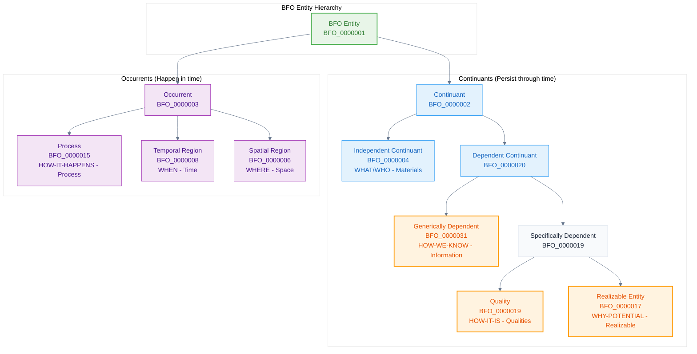
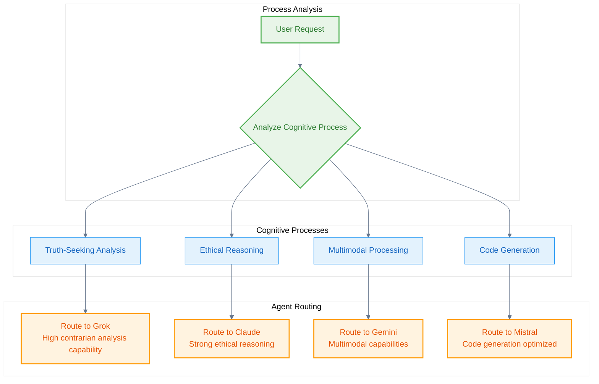

# Top-Level

The **Basic Formal Ontology (BFO)** provides the foundational framework for the Naas Ontology. BFO is a top-level ontology that systematically categorizes all entities that exist or can exist.

## BFO 7 Buckets Framework

BFO organizes all entities into seven fundamental categories, captured in the mnemonic: *"What and who are the materials, how-they-are their qualities, why they can do something are realizable, how-it-happens is the process, when and where give time and space, and how-we-know is the information."*



## Core BFO Classes in Naas Ontology

### 1. Material Entities (WHAT/WHO)
Independent continuants that exist in their own right:

```turtle
@prefix bfo: <http://purl.obolibrary.org/obo/> .
@prefix abi: <http://ontology.naas.ai/abi/> .
@prefix owl: <http://www.w3.org/2002/07/owl#> .
@prefix rdfs: <http://www.w3.org/2000/01/rdf-schema#> .
@prefix skos: <http://www.w3.org/2004/02/skos/core#> .

# AI Systems as material entities
abi:AISystem a owl:Class ;
    rdfs:subClassOf bfo:BFO_0000040 ; # Material Entity
    rdfs:label "AI System"@en ;
    skos:definition "A material entity that implements artificial intelligence capabilities."@en ;
    skos:example "ChatGPT server infrastructure, Claude API endpoints, Gemini model instances."@en .

abi:AIModelInstance a owl:Class ;
    rdfs:subClassOf bfo:BFO_0000040 ; # Material Entity
    rdfs:label "AI Model Instance"@en ;
    skos:definition "A material entity that is a specific instantiation of an AI model running on hardware."@en .
```

### 2. Qualities (HOW-IT-IS)
Properties that inhere in material entities:

```turtle
# Performance qualities of AI systems
abi:IntelligenceScore a owl:Class ;
    rdfs:subClassOf bfo:BFO_0000019 ; # Quality
    rdfs:label "Intelligence Score"@en ;
    skos:definition "A quality that measures the cognitive capability of an AI system."@en .

abi:ResponseSpeed a owl:Class ;
    rdfs:subClassOf bfo:BFO_0000019 ; # Quality
    rdfs:label "Response Speed"@en ;
    skos:definition "A quality that measures how quickly an AI system responds to queries."@en .

abi:CostPerToken a owl:Class ;
    rdfs:subClassOf bfo:BFO_0000019 ; # Quality
    rdfs:label "Cost Per Token"@en ;
    skos:definition "A quality that measures the financial cost per token processed."@en .
```

### 3. Realizable Entities (WHY-POTENTIAL)
Capabilities and roles that can be realized:

```turtle
# Agent roles and capabilities
abi:AgentRole a owl:Class ;
    rdfs:subClassOf bfo:BFO_0000017 ; # Realizable Entity
    rdfs:label "Agent Role"@en ;
    skos:definition "A realizable entity that defines the specialized function or role of an AI agent."@en ;
    skos:example "Primary responder, fallback handler, specialized task executor."@en .

abi:CognitiveCapability a owl:Class ;
    rdfs:subClassOf bfo:BFO_0000017 ; # Realizable Entity
    rdfs:label "Cognitive Capability"@en ;
    skos:definition "A realizable entity that represents a cognitive ability of an AI system."@en ;
    skos:example "Truth-seeking analysis, ethical reasoning, multimodal processing."@en .
```

### 4. Processes (HOW-IT-HAPPENS)
Temporal occurrents that unfold over time:

```turtle
# AI processing activities
abi:AIProcessing a owl:Class ;
    rdfs:subClassOf bfo:BFO_0000015 ; # Process
    rdfs:label "AI Processing"@en ;
    skos:definition "A process in which an AI system analyzes input and generates output."@en .

abi:AgentRouting a owl:Class ;
    rdfs:subClassOf bfo:BFO_0000015 ; # Process
    rdfs:label "Agent Routing"@en ;
    skos:definition "A process of selecting the appropriate AI agent based on cognitive requirements."@en .

abi:KnowledgeGraphConstruction a owl:Class ;
    rdfs:subClassOf bfo:BFO_0000015 ; # Process
    rdfs:label "Knowledge Graph Construction"@en ;
    skos:definition "A process of building structured knowledge representations from data."@en .
```

### 5. Information Entities (HOW-WE-KNOW)
Generically dependent continuants that carry information:

```turtle
# Information structures
abi:OntologyDefinition a owl:Class ;
    rdfs:subClassOf bfo:BFO_0000031 ; # Generically Dependent Continuant
    rdfs:label "Ontology Definition"@en ;
    skos:definition "An information entity that specifies the structure and meaning of an ontology."@en .

abi:SPARQLQuery a owl:Class ;
    rdfs:subClassOf bfo:BFO_0000031 ; # Generically Dependent Continuant
    rdfs:label "SPARQL Query"@en ;
    skos:definition "An information entity that represents a query in SPARQL language."@en .
```

## BFO Relations

BFO provides fundamental relations that connect entities:

```turtle
# Temporal relations
bfo:BFO_0000108 rdfs:label "exists at"@en ;
    skos:definition "A relation between a particular and some temporal region at which the particular exists"@en .

# Spatial relations  
bfo:BFO_0000124 rdfs:label "location of"@en ;
    skos:definition "A relation between a spatial region and an independent continuant"@en .

# Participation relations
bfo:BFO_0000056 rdfs:label "participates in"@en ;
    skos:definition "A relation between a continuant and a process"@en .

# Quality relations
bfo:BFO_0000086 rdfs:label "has quality"@en ;
    skos:definition "A relation between an independent continuant and a quality"@en .
```

## Process-Centric Routing Logic

The BFO foundation enables process-centric AI routing by categorizing cognitive needs:



## Implementation Example

Here's how BFO categories are applied in the Naas Ontology:

```turtle
# A complete example: Grok AI system
abi:grok_instance a abi:AISystem ;
    rdfs:label "Grok AI Instance"@en ;
    bfo:BFO_0000086 abi:grok_intelligence_score ; # has quality
    bfo:BFO_0000087 abi:contrarian_analysis_role . # has role

abi:grok_intelligence_score a abi:IntelligenceScore ;
    rdfs:label "Grok Intelligence Score"@en ;
    abi:hasNumericValue "73"^^xsd:integer .

abi:contrarian_analysis_role a abi:CognitiveCapability ;
    rdfs:label "Contrarian Analysis Capability"@en ;
    skos:definition "The capability to provide contrarian and truth-seeking analysis"@en .

# Process instance
abi:truth_seeking_process_001 a abi:AIProcessing ;
    rdfs:label "Truth Seeking Analysis Process"@en ;
    bfo:BFO_0000057 abi:grok_instance ; # has participant
    bfo:BFO_0000066 abi:contrarian_analysis_role . # realizes
```

## Next Steps

The BFO foundation provides the systematic basis for:

1. **[Mid-Level](/ontology-essentials/mid-level)** - Common Core Ontologies that build on BFO
2. **[Domain-Level](/ontology-essentials/domain-level)** - Specific domains grounded in BFO categories
3. **[Process-Centric Routing](/ontology-essentials/process-routing)** - AI routing based on BFO process analysis

---

*BFO provides the rigorous ontological foundation that ensures consistency and interoperability across all levels of the Naas Ontology.*
